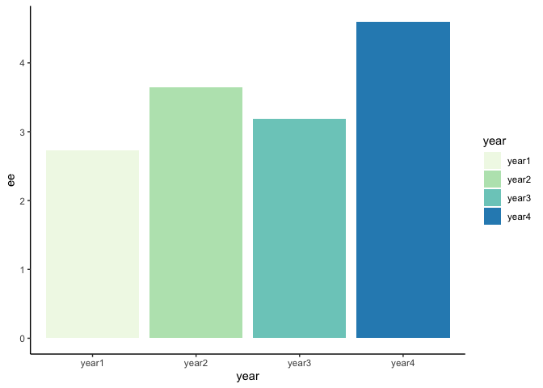
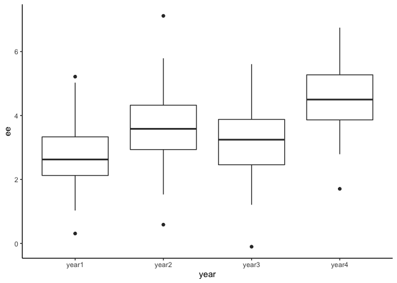
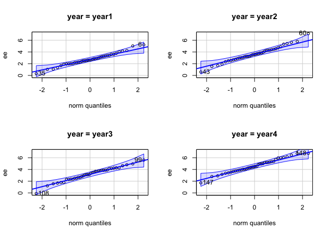
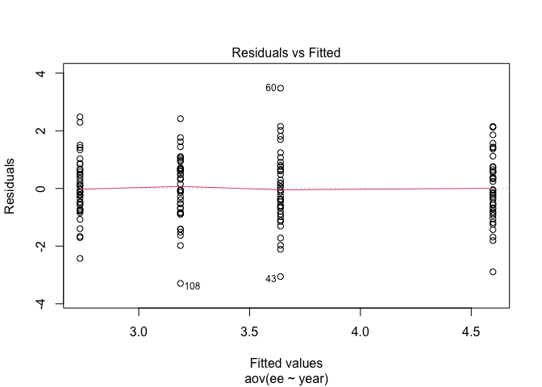
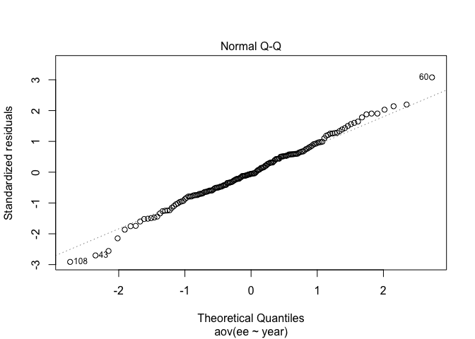
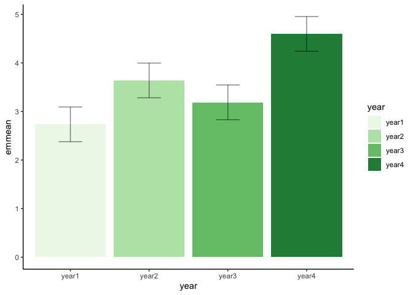

# one-way ANOVA (analysis of variances)

บทนี้ต้องเริ่มต้นด้วยการแปล
เหมียวบอก
Analysis of Variances คือ การวิเคราะห์ความแปรปรวน

> ความแปรปรวนแบบผู้หญิงเมนส์หรือเปล่า
>
> ไม่ใช่!!

### Variance คืออะไร

    S^2 = \frac{\sum (x_i - \bar{x})^2}{n - 1}
    S^2 =   sample variance
    x_i =   the value of the one observation
    \bar{x} =   the mean value of all observations
    n   =   the number of observations

ความแปรปรวนที่เกิดจาก การบวกกันอย่างต่อเนื่องของ (ข้อมูลแต่ละจุด - ค่าเฉลี่ยของชุดข้อมูลนั้น) แล้ว / (หาร) ด้วย จำนวนกลุ่มตัวอย่าง - 1

### variance มีความสำคัญอย่างไร

ถ้าย้อนกลับไปในเรื่อง [**CLT**]() เราจะเริ่มคุ้นเคยกับ Standard Deviation (ค่าเบี่ยงเบนออกไปจากค่าเฉลี่ย)


ทีนี้ Variances ก็คือ Standard Deviation ที่ยังไม่ square root นั่นเอง


>
> แล้วมันมีความสำคัญอย่างไร?

Variances จะช่วยอธิบายตัวแปรที่เราต้องการอธิบาย หรือตัวแปรตาม นี่แหละ

### ANOVA คืออะไร

คือการวิเคราะห์ที่มีตัวแปรต้นเป็นตัวแปรจัดกลุ่มเป็นตัวแปรต้น และมีตัวแปรตามเป็นตัวแปรแบบต่อเนื่อง และมีข้อตกลงเบื้องต้น ดังนี้

\* ตัวแปรตาม (dependent variable) หรือตัวแปร criterion
ควรอยู่ในรูปของตัวแปรต่อเนื่อง (see: levels of measurements)
ไม่ว่าจะเป็นแบบ interval หรือ ratio

\* ตัวแปรต้น (independent variable)
ควรมีลักษณะเป็นกลุ่มจำนวนกี่กลุ่มก็ได้ (เอาจริงๆ ไม่ควรเกิน 4) กลุ่ม
และมีการสุ่มให้เข้ากลุ่มแบบอิาระจากกัน

\* ข้อมูลไม่ควรมีค่าสุดโต่ง (outliers) เพราะการใช้ค่าเฉลี่ย (mean)
ในการคำนวณมีความเสี่ยงจะเกิดอคติสูง

\* ตัวแปรตาม (dependent variable) ควรอย่างน้อยมีโค้งเป็นปกติในแต่ละกลุ่ม
แม้ว่าการทดสอบ F-test จะค่อนข้างแข็งแกร่ง (robust)
ต่อการเบ้ของข้อมูลก็ตาม เราสามารถทดสอบได้ด้วย Shapiro-Wilk test of
normality

และข้อที่สำคัญที่สุด

\* variances ของ residuals แต่ละกลุ่มต้องมีความเท่ากัน ที่เรียกว่า homogeneity of varainces or homoscedasticity

\_\_\_

## เรามาลองทำชุดข้อมูลวิเคราะห์ผล F-test กัน

> สมมติว่า มีนิสิต 4 ชั้นปี คือ ปี 1, 2, 3, และ 4 แล้วเราต้องการวัด
> emotional engagement in classrooom หรือ
> การเข้าร่วมในการเรียนเชิงอารมณ์ โดยมีข้อมูลที่เก็บมาดังนี้

``` r
set.seed(1990)
year1 <- rnorm(n = 40, mean = 3.1, sd = 1.2)
year2 <- rnorm(n = 40, mean = 4.0, sd = 1.3)
year3 <- rnorm(n = 40, mean = 3.5, sd = 1.1)
year4 <- rnorm(n = 40, mean = 4.6, sd = 1.0)

faculty <- data.frame(year1, year2, year3, year4)
faculty <- tidyr::gather(faculty, year, ee, year1:year4, factor_key = TRUE)
```

ลองสร้างกราฟแท่ง

``` r
library(ggplot2)
ggplot(faculty) +
      geom_bar(aes(x = year, y = ee, fill = year), stat = "summary") +
      theme_classic() +
      scale_fill_brewer(palette = 4)
```



ดูจากกราฟแท่ง ดูเหมือนว่าปี 4 จะมีความผูกพันธ์ทางอารมณ์ในการเรียนสูงสุด รองลงมาเป็น ปี 2, ปี 3 และ ปี 1 ตามลำดับ

เรามาลองดูข้อมูลจาก `boxplot()` กัน

``` r
ggplot(faculty) +
      geom_boxplot(aes(x = year, y = ee)) +
      theme_classic()
```



### ทดสอบข้อตกลงเบื้องต้น

เรามาทดสอบข้อตกลงเบื้องต้นของ ANOVA ทีละข้อกัน แต่ก่อนที่จะทดสอบ เราจะสร้างโมเดลไว้รอก่อน

``` r
model_1way_anova <- aov(ee ~ year, data = faculty)
```

-   ทดสอบ normality
``` r
car::qqPlot(ee ~ year, data = faculty)
```



-   ทดสอบ Homogeneity
``` r
plot(model_1way_anova, 1)
```


``` r
    plot(model_1way_anova, 2)
```



ดูจากกราฟที่ 1 แล้ว residuals ในแต่ละกลุ่มดูแยกจากกันพอดีพอดีนะ กราฟที่ 2 จะเป็น normality ของ residuals แมวคิดว่าก็ดูสวยงามอยู่~

มาทดสอบ ANOVA กันเลย

``` r
    #model_1way_anova <- aov(ee ~ year, data = faculty) เขียนไว้แล้ว
    summary(model_1way_anova)
```

    ##              Df Sum Sq Mean Sq F value   Pr(>F)    
    ## year          3  76.03   25.34   19.35 1.02e-10 ***
    ## Residuals   156 204.33    1.31                     
    ## ---
    ## Signif. codes:  0 '***' 0.001 '**' 0.01 '*' 0.05 '.' 0.1 ' ' 1

เราจะพบว่า
…
…
…
งงสิ งงใช่ไหม

พอดีแมวลืมบอกสมมติฐานของ ANOVA ไป แต่บอกตอนนี้ก็ได้ค่ะ

## สมมติฐานททางสถิติของ ANOVA

เวลาเราทดสอบค่าเฉลี่ยกลุ่ม เราจะเชื่อว่า *“มันไม่มีกลุ่มไหนต่างกันหรอก”* เขียนเป็นภาษาคณิตศาตร์คือ

> Ho : μ1 = μ2 = μ3 = μ4 (สมมติว่ามี 4 กลุ่ม)
>
> ดังนั้น เวลาทดสอบ ANOVA f-test
> จะบอกเราแค่ว่ามีกลุ่มใดกลุ่มหนึ่งที่แตกต่างออกไปจากทุกกลุ่มไหม
>
> Ho : μ1 - μ2 - μ3 - μ4 = 0 นั่นเอง

    ดังนั้น

    Df Sum Sq Mean Sq F value   Pr(>F)    
    year          3  76.03   25.34   19.35 1.02e-10 ***
    Residuals   156 204.33    1.31  

ผลของการวิเคราะห์สามารถบอกว่า ในการทดสอบความแปรปรวนแบบทางเดียวพบว่ามีกลุ่มใดกลุ่มหนึ่งต่างจากเพื่อน (*F*(3, 156) = 76.03, *p* &lt; 0.001)

>
> แล้วถ้าเราอยากรู้ว่ากลุ่มไหนที่เป็นแกะดำ เราต้องทำอย่างไรล่ะ?

## การเปรียบเทียบค่าเฉลี่ยทุกกลุ่ม (multiple comparisons)

การเปรียบเทียบค่าเฉลี่ยรายคู่ทุกกลุ่มเป็นการวิเคราะห์เพิ่มเติมจากผลที่เราได้จากการทดสอบ f วิธีการวิเคราะห์คือการนำทุกคู่มาเปรียบเทียบกัน (see: **family-wise
error rate**; **FWER**)

โดยในการเปรียบเทียบนี้ เราจะใช้ package `emmeans` ที่ย่อมาจาก estimate marginal mean นี่เอง

``` r
library(emmeans)
contrast(emmeans(model_1way_anova, ~ year), method = "pairwise", adjust = "bonferroni")
```

    ##  contrast      estimate    SE  df t.ratio p.value
    ##  year1 - year2   -0.904 0.256 156 -3.534  0.0032 
    ##  year1 - year3   -0.453 0.256 156 -1.771  0.4714 
    ##  year1 - year4   -1.863 0.256 156 -7.279  <.0001 
    ##  year2 - year3    0.451 0.256 156  1.764  0.4784 
    ##  year2 - year4   -0.958 0.256 156 -3.745  0.0015 
    ##  year3 - year4   -1.410 0.256 156 -5.509  <.0001 
    ## 
    ## P value adjustment: bonferroni method for 6 tests

เราจะพบว่ามีการเปรียบเทียบทุกชั้นปีเลย ซึ่งผลที่ออกมาก็พบว่าปีที่เป็นแตกต่างอย่างมีนัยสำคัญคือระหว่าง ปี 1 กับ ปี 4 และ ปี 3 กับ ปี 4

>
> แล้วอะไรคือ contrast pairwise bonferroni งงมากเลยแมว


อันนี้ต้องเอา concept เรื่องการทดสอบคู่ไปอ่านก่อนนะ

### สร้างกราฟให้เป็นนิสัย

``` r
emm <- emmeans(model_1way_anova, ~ year)
emm.s <- summary(emm)

library(ggplot2)
ggplot(emm.s) +
      geom_col(aes(x = year, y = emmean, fill = year)) +
      geom_errorbar(aes(x = year, y = emmean, ymin = lower.CL, 
                        ymax = upper.CL, width = .3), alpha = .5) +
      theme_classic() +
      scale_fill_brewer(palette = 5)
```


