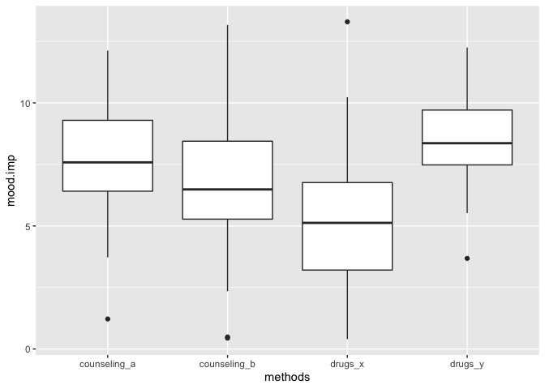
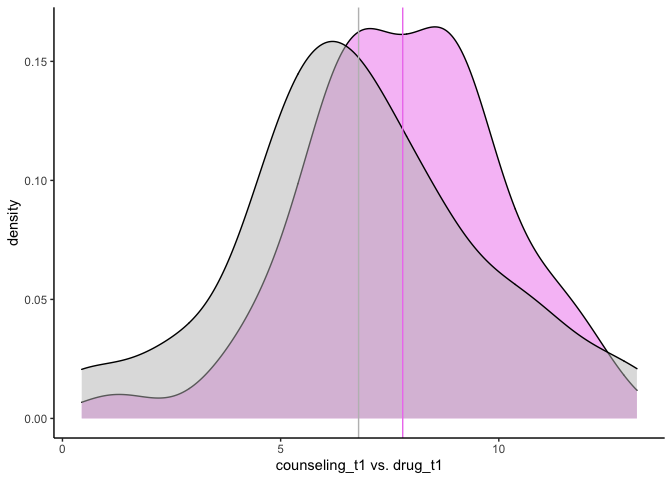

# Sum of Square
SS- คืออะไร

Sum of Square คือค่ารวมของความแปรปรวน (variance: see Confident Interval) ซึ่งเป็นการคำนวณในการหาค่ารวมของโมเดลทำนาย โดยเฉพาะใน regression โดยมีสูตรทางคณิตศาสตร์ คือ

    Sum of Square = ∑n(i=1)(Xi - X-)^2

ใน Sum of Square สามารถบอกเราได้ว่า ในโมเดลดังกล่าวมีค่าที่เบี่ยงเบนจากค่ากลาง (Mean) มากน้อยเพียงใด โดยปกติแล้ว ผู้อ่านสายจิตวิทยาจะพบ SS บ่อยในผลวิเคราะห์ของตระกูล
Analysis of Variances (แต่ SS ใช้ในโมเดล regression อีกด้วยนะ ซึ่งจะใช้ในรูปแบบข้อ RSS)

เราลองมาสร้างชุดข้อมูลเพื่อใช้ในการอธิบาย Sum of Square กันค่ะ

``` r
#mode_improvement
set.seed(1990)
counseling_b <- abs(rnorm(45, 7.7, sd = 3.1))
drugs_x <- abs(rnorm(45, 6.1, sd = 3))

counseling_a <- abs(rnorm(45, 8.1, sd = 2.1))
drugs_y <- abs(rnorm(45, 8.6, sd = 1.7))

data_w <- data.frame(counseling_a, counseling_b, drugs_x, drugs_y)
data <- reshape2::melt(data_w, measure.vars = c("counseling_a", "counseling_b", "drugs_x", "drugs_y"))

colnames(data) <- c("methods", "mood.imp")

psych::describe(data_w)
```


    ##              vars  n mean   sd median trimmed  mad  min   max range  skew
    ## counseling_a    1 45 7.80 2.22   7.58    7.84 2.03 1.22 12.12 10.90 -0.33
    ## counseling_b    2 45 6.79 2.84   6.49    6.79 2.39 0.44 13.17 12.72  0.05
    ## drugs_x         3 45 5.16 2.67   5.13    5.04 2.51 0.40 13.30 12.89  0.52
    ## drugs_y         4 45 8.61 1.76   8.36    8.61 1.76 3.68 12.25  8.57 -0.07
    ##              kurtosis   se
    ## counseling_a     0.30 0.33
    ## counseling_b    -0.07 0.42
    ## drugs_x          0.38 0.40
    ## drugs_y          0.28 0.26


``` r
    psych::describe(data)
```


    ##          vars   n mean   sd median trimmed  mad min  max range  skew kurtosis
    ## methods*    1 180 2.50 1.12   2.50    2.50 1.48 1.0  4.0  3.00  0.00    -1.38
    ## mood.imp    2 180 7.09 2.72   7.17    7.17 2.55 0.4 13.3 12.89 -0.25    -0.15
    ##            se
    ## methods* 0.08
    ## mood.imp 0.20


``` r
    table(data$methods)
```


    ## 
    ## counseling_a counseling_b      drugs_x      drugs_y 
    ##           45           45           45           45


สมมติว่าเป็นชุดข้อมูลที่เป็นคะแนน `Mood Improvement` ในผู้ป่วยที่มีอาการซึมเศร้า เงื่อนไขคือ ได้รับการปรึกษา `(counseling)` ชนิด a,b หรือ ได้รับยา `(drugs)` ชนิด x,y

**สร้าง `boxplot` และ `density`**


``` r
    library(ggplot2)
    library(tidyr)
    ggplot(data) +
      geom_boxplot(aes(x = methods, y = mood.imp))
```



    # separate each group fot the sake of t = 1

เราจะเห็นว่าเมื่อเปรียบเทียบ 4 กลุ่มใน boxplot จะเห็นความแตกต่างไม่มากนัก

เราลองมาลองเคราะห์ t-test อย่างง่ายโดยเปรียบเทียบกลุ่ม at t = 1

``` r
    t.test(counseling_a, counseling_b, var.equal = TRUE)
```

    ## 
    ##  Two Sample t-test
    ## 
    ## data:  counseling_a and counseling_b
    ## t = 1.8794, df = 88, p-value = 0.06349
    ## alternative hypothesis: true difference in means is not equal to 0
    ## 95 percent confidence interval:
    ##  -0.05802026  2.08030420
    ## sample estimates:
    ## mean of x mean of y 
    ##  7.797758  6.786616


``` r
    #or
    t.test(counseling_a, counseling_b) #Whelch
```


    ## 
    ##  Welch Two Sample t-test
    ## 
    ## data:  counseling_a and counseling_b
    ## t = 1.8794, df = 83.169, p-value = 0.06369
    ## alternative hypothesis: true difference in means is not equal to 0
    ## 95 percent confidence interval:
    ##  -0.05888658  2.08117053
    ## sample estimates:
    ## mean of x mean of y 
    ##  7.797758  6.786616


``` r
# separate each group fot the sake of t = 1
library(ggplot2)
ggplot(data_w) +
      geom_density(aes(x = counseling_a), fill = "violet", alpha = 0.5) +
      geom_density(aes(x = counseling_b), fill = "gray", alpha = 0.5) +
      xlab("counseling_t1 vs. drug_t1") +
      geom_vline(xintercept =  mean(data_w$counseling_a), color = "violet") +
      geom_vline(xintercept = mean(data_w$counseling_b), color = "gray") +
      theme_classic()
```




จะเห็นได้ว่า เมื่อใช้ t-test และ Welch t-test จะมีผลไม่แตกต่างกันมากนัก แต่ว่าถ้าเราทำ t-test แบบนี้ให้ครบทุกคู่ ค่า alpha จะเฟ้อมากทำให้เกิด
Type I error หรือ False positive สูงขึ้น (see Type I & Type II error)

## Sum of Square in two-way ANOVA
(see One-way ANOVA)

เราจะสมมติว่าข้อมูลในแต่ละกลุ่มมาจากกลุ่มอิสระจากกันก่อนนะคะ เพื่อความเข้าใจในการวิเคราะห์แบบ two-way ANOVA นี้
แต่เมื่อนำไปวิเคราะห์แบบ two-way ANOVA แล้วจะพบผลที่ชัดเจนมากขึ้น แต่ว่าทีนี้ Sum of Square ที่นำมาวิเคราะห์จะมี 3 ประเภทค่ะ


-   Type I: จะเป็นการใส่ตัวแปรที่ 1 เช่น (counseling) ในโมเดลเข้าไป
    แล้วใส่ค่าที่เหลือสูงสุดของตัวแปรที่ 2 (drugs) เข้าไปในโมเดล
    แล้วจึงนำค่าเหลือ (residual) เข้าตามไป

    SS(A) สำหรับตัวแปร Counseling
    SS(B | A) สำหรับตัวแปร Drugs \* | อ่านว่า given (ก็ต่อเมื่อ)
    SS(AB | B, A) ถ้าต้องการหา interaction effect ซึ่ง type I
        จะไม่เหมาะกับการหา effect
        ที่มาผสมกันเพราะเป็นการนำตัวแปรเข้าทีละตัวค่ะ

-   Type II: คือการที่ใส่ตัวแปร A และ B
    เข้าพร้อมกันโดยใช้ความแปรปรวนของทั้งคู่ แต่จะไม่คำนวณส่วนที่เป็น
    interaction effect ให้เรา

    SS(A | B) สำหรับตัวแปร Counseling –&gt; Drugs
    SS(B | A) สำหรับตัวแปร Drugs –&gt; Counseling

-   Type III: จะเป็นการผสมวิธีกันระหว่าง Type I & II
    คือการที่ตัวแปรที่ใส่เข้าสมการ 1.) จะไม่เรียงลำดับ และ 2.)
    สามารถคำนวณ interaction effect ได้

    SS(A | B, AB) สำหรับตัวแปร Counseling —&gt; Counseling\*Drugs
    SS(B | A, AB) สำหรับตัวแปร Drugs —&gt; Counseling\*Drugs


**เราลองมาคำนวณ type I และ Type III จาก R code กันค่า**

``` r
    model_typeI <- aov(mood.imp ~ methods, data = data)
    summary(model_typeI)
```

    ##              Df Sum Sq Mean Sq F value   Pr(>F)    
    ## methods       3  298.7   99.56   17.11 8.55e-10 ***
    ## Residuals   176 1024.3    5.82                     
    ## ---
    ## Signif. codes:  0 '***' 0.001 '**' 0.01 '*' 0.05 '.' 0.1 ' ' 1

``` r
    model_typeIII <- lm(mood.imp ~ methods, data = data)
    car::Anova(model_typeIII, type = 3) #Type III
```

    ## Anova Table (Type III tests)
    ## 
    ## Response: mood.imp
    ##              Sum Sq  Df F value    Pr(>F)    
    ## (Intercept) 2736.23   1 470.156 < 2.2e-16 ***
    ## methods      298.69   3  17.108  8.55e-10 ***
    ## Residuals   1024.29 176                      
    ## ---
    ## Signif. codes:  0 '***' 0.001 '**' 0.01 '*' 0.05 '.' 0.1 ' ' 1

ทีนี้ผลจะออกมาไม่แตกต่างนักกันระหว่าง Sum of Square ของ type I และ Type III เพราะว่ามี equal variances
โดยปกติแล้ว Sum of Square ในการทดสอบที่แตกต่างกัน จะมีความเสมือนกัน แต่อธิบายแตกต่างกัน
เช่น ANOVA vs. Linear Regression

เราไปต่อที่การทดสอบข้อตกลงเบื้องต้นที่สุดกันคราวหน้าน้า


------
กลับไปที่ [Datastist.com](www.datastist.com)
