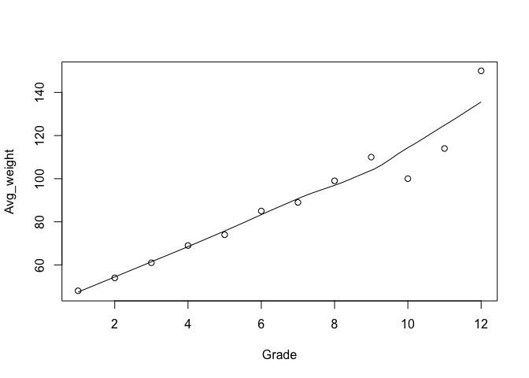
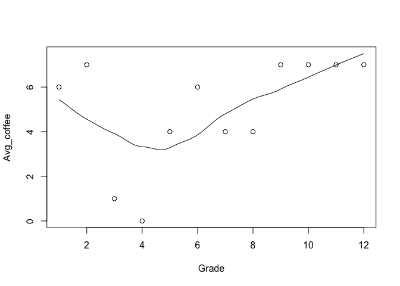

# ทำความคุ้นเคยกับความสัมพันธ์แบบเส้นตรง

## ความสัมพันธ์ สหสัมพันธ์ หรือ correlation

การทดสอบ correlation คือการทดสอบความสัมพันธ์ระหว่างตัวแปร 2 ตัว ซึ่งจะทำให้เรารู้ว่า เมื่อตัวหนึ่งเพิ่มขึ้นอีกตัวเพิ่มขึ้นตามไหม

ตัวอย่าง


> การบริโภคกาแฟเฉลี่ย และน้ำหนักเฉลี่ย มีความสัมพันธ์กับนักเรียนแต่ละชั้น (grade 1 - 12)

ในบทนี้ เราจะสร้าง `dataframe` ขึ้นมาด้วย r

``` r
Grade <- 1:12
Avg_weight <- c(48, 54, 61, 69, 74, 85, 89, 99, 110, 100, 114, 150)
Avg_coffee <- c(6, 7, 1, 0, 4, 6, 4, 4, 7, 7, 7, 7)
data <- cbind(Grade, Avg_weight, Avg_coffee)
head(data)
```


    ##      Grade Avg_weight Avg_coffee
    ## [1,]     1         48          6
    ## [2,]     2         54          7
    ## [3,]     3         61          1
    ## [4,]     4         69          0
    ## [5,]     5         74          4
    ## [6,]     6         85          6

หลังจากนั้นเราจะใช้ `scatter plot` ด้วยคำสั่ง `scatter.smooth()`
ในการดูความสัมพันธ์ด้วยสายตาของ Grade กับ น้ำหนักเฉลี่ย (Avg\_weight)

``` r
scatter.smooth(Grade, Avg_weight, family = "gaussian")
```



กราฟแสดงถึงการที่ยิ่ง `Grade` สูงขึ้นเท่าไหร่ `น้ำหนัก`ก็จะสูงขึ้น ซึ่งสมเหตุสมผล (โตขึ้น น้ำหนักมากขึ้น)

ที่นี้เรามาดูความสัมพันธ์ของ `Grade` กับ `ค่าเฉลี่ยจำนวนกาแฟที่ดื่มต่อสัปดาห์`

``` r
    scatter.smooth(Grade, Avg_coffee, family = "gaussian")
```



จะเห็นได้ว่า `Grade` และ `จำนวนกาแฟเฉลี่ยที่กิน` ไม่มีความสัมพันธ์กัน

ถ้าความสัมพันธ์ของทั้งสองตัวแปรเป็นเส้นตรงและมีความชันสูงก็ยิ่งมีความสัมพันธ์กันสูง

-   ความสัมพันธ์ที่เท่ากับ 0 หมายถึงไม่มีความสัมพันธ์ใด ๆ ของตัวแปร

-   ความสัมพันธ์ระหว่าง -1 หรือ 1 แสดงถึงการมีความสัมพันธ์
    ยิ่งค่ามีความใกล้ -1 (เช่น -0.98) หรือ 1 (เช่น 0.8)
    แสดงถึงความความสัมพันธ์ที่มีมาก ในขณะที่ความสัมพันธ์ประมาณ -0.5 หรือ
    +0.5 แสดงถึงความสัมพันธ์เบา ๆ

เรามาลองทดสอบความสัมพันธ์ของตัวแปรกัน ด้วยำสั่ง `cor.test()`

``` r
    cor.test(Grade, Avg_weight)
```

    ##  Pearson's product-moment correlation
    ## 
    ## data:  Grade and Avg_weight
    ## t = 10.996, df = 10, p-value = 6.614e-07
    ## alternative hypothesis: true correlation is not equal to 0
    ## 95 percent confidence interval:
    ##  0.8632963 0.9893030
    ## sample estimates:
    ##       cor 
    ## 0.9610489

จะเห็นได้ว่า จากผลการทดสอบของ Pearson’s correaltion ของ `Grade` และ `Avg_weight` มีความสัมพันธ์กันที่ 0.961 อย่างมีนัยสำคัญทางสถิติที่ *p* &lt; 0.001

ที่นี้มาดูความสัมพันธ์ของ `Grade` และ `Avg_Coffee` กันบ้าง

``` r
cor.test(Grade, Avg_coffee)
```

    ##  Pearson's product-moment correlation
    ## 
    ## data:  Grade and Avg_coffee
    ## t = 1.5609, df = 10, p-value = 0.1496
    ## alternative hypothesis: true correlation is not equal to 0
    ## 95 percent confidence interval:
    ##  -0.1759887  0.8106090
    ## sample estimates:
    ##       cor 
    ## 0.4426174

จากผลการทดสอบของ Pearson’s correaltion `Grade` และ `Avg_Coffee` มีความสัมพันธ์กันที่ 0.442 ซึ่งไม่ถึงนัยสำคัญทางสถิติ

เย้!
