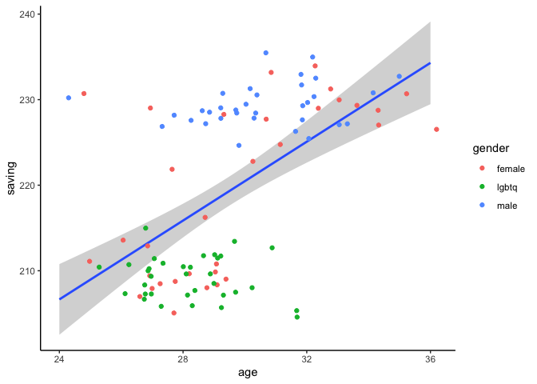
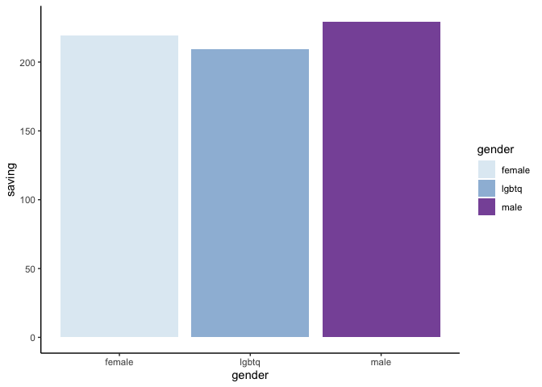

# R for data generating

ปกติแล้ว เราจะใช้ชุดช้อมูลที่มาจากการเก็บข้อมูลของเราเอง ทั้งแบบ Survey และ Experiment หรือมาจาก database SQL

บทนี้เราจะมาเรียนการสร้างข้อมูลจากการเขียน code พื้นฐานค่ะ

หลัก ๆ เราจะใช้คำสั่งต่อไปนี้คือ `seq()`, `rep()`, `c()`, `cbind()`, `rbind()`, `matrix()`, และ `data.frame()` เรามาเริ่มดูตัวอย่างเพื่อให้เห็นภาพกัน

``` r
D1 <- seq(1:30)
D2 <- rep(1:15, 2)
D3 <- c(31:60)
D3.cha <- c("ab", "cd", "ef")
D4 <- cbind(D1, D2, D3)
D5 <- rbind(D1, D2, D3)
D6 <- matrix(D1, nrow = 10, ncol = 3)
D7 <- data.frame(D1, D2, D3)
```

เราจะเรียกวัตถุและชุดขึ้นมา

``` r
D1
```


    ##  [1]  1  2  3  4  5  6  7  8  9 10 11 12 13 14 15 16 17 18 19 20 21 22 23 24 25
    ## [26] 26 27 28 29 30

**D1** จากคำสั่ง `seq()` หรือ sequence จะเป็น vector ที่มีเลข 1 ถึง 30


``` r
D2
```


    ##  [1]  1  2  3  4  5  6  7  8  9 10 11 12 13 14 15  1  2  3  4  5  6  7  8  9 10
    ## [26] 11 12 13 14 15

**D2** จากคำสั่ง `rep()` หรือ replicate จะเป็น vector ที่มีเลข 1 ถึง 15
วนไป 2 ครั้ง


``` r
D3
```


    ##  [1] 31 32 33 34 35 36 37 38 39 40 41 42 43 44 45 46 47 48 49 50 51 52 53 54 55
    ## [26] 56 57 58 59 60


``` r
D3.cha
```


    ## [1] "ab" "cd" "ef"

**D3** มาจากคำสั่ง `c()` ซึ่งบางครเรียก combine บางคนเรียก concatenate จะเป็นการสร้าง vector ที่เราสามารถเลือกใส่ชุดข้อมูลส่งไปเองได้


``` r
    D4
```


    ##       D1 D2 D3
    ##  [1,]  1  1 31
    ##  [2,]  2  2 32
    ##  [3,]  3  3 33
    ##  [4,]  4  4 34
    ##  [5,]  5  5 35
    ##  [6,]  6  6 36
    ##  [7,]  7  7 37
    ##  [8,]  8  8 38
    ##  [9,]  9  9 39
    ## [10,] 10 10 40
    ## [11,] 11 11 41
    ## [12,] 12 12 42
    ## [13,] 13 13 43
    ## [14,] 14 14 44
    ## [15,] 15 15 45
    ## [16,] 16  1 46
    ## [17,] 17  2 47
    ## [18,] 18  3 48
    ## [19,] 19  4 49
    ## [20,] 20  5 50
    ## [21,] 21  6 51
    ## [22,] 22  7 52
    ## [23,] 23  8 53
    ## [24,] 24  9 54
    ## [25,] 25 10 55
    ## [26,] 26 11 56
    ## [27,] 27 12 57
    ## [28,] 28 13 58
    ## [29,] 29 14 59
    ## [30,] 30 15 60


``` r
D5
```


    ##    [,1] [,2] [,3] [,4] [,5] [,6] [,7] [,8] [,9] [,10] [,11] [,12] [,13] [,14]
    ## D1    1    2    3    4    5    6    7    8    9    10    11    12    13    14
    ## D2    1    2    3    4    5    6    7    8    9    10    11    12    13    14
    ## D3   31   32   33   34   35   36   37   38   39    40    41    42    43    44
    ##    [,15] [,16] [,17] [,18] [,19] [,20] [,21] [,22] [,23] [,24] [,25] [,26]
    ## D1    15    16    17    18    19    20    21    22    23    24    25    26
    ## D2    15     1     2     3     4     5     6     7     8     9    10    11
    ## D3    45    46    47    48    49    50    51    52    53    54    55    56
    ##    [,27] [,28] [,29] [,30]
    ## D1    27    28    29    30
    ## D2    12    13    14    15
    ## D3    57    58    59    60

**D4** จะมาจากคำสั่ง `cbind()` ที่เป็นการรวมกันของในรูปแบบคอลลัมภ์ vector และ D5 จะมาจาก `rbind()` ที่เป็นการรวมกันในรูปแบบแถว


``` r
    D6
```


    ##       [,1] [,2] [,3]
    ##  [1,]    1   11   21
    ##  [2,]    2   12   22
    ##  [3,]    3   13   23
    ##  [4,]    4   14   24
    ##  [5,]    5   15   25
    ##  [6,]    6   16   26
    ##  [7,]    7   17   27
    ##  [8,]    8   18   28
    ##  [9,]    9   19   29
    ## [10,]   10   20   30


``` r
    D7
```


    ##    D1 D2 D3
    ## 1   1  1 31
    ## 2   2  2 32
    ## 3   3  3 33
    ## 4   4  4 34
    ## 5   5  5 35
    ## 6   6  6 36
    ## 7   7  7 37
    ## 8   8  8 38
    ## 9   9  9 39
    ## 10 10 10 40
    ## 11 11 11 41
    ## 12 12 12 42
    ## 13 13 13 43
    ## 14 14 14 44
    ## 15 15 15 45
    ## 16 16  1 46
    ## 17 17  2 47
    ## 18 18  3 48
    ## 19 19  4 49
    ## 20 20  5 50
    ## 21 21  6 51
    ## 22 22  7 52
    ## 23 23  8 53
    ## 24 24  9 54
    ## 25 25 10 55
    ## 26 26 11 56
    ## 27 27 12 57
    ## 28 28 13 58
    ## 29 29 14 59
    ## 30 30 15 60

**D6** มาจากคำสั่ง `matrix()` ที่เรา subset ข้อมูลของ D4 ให้เป็นแถวแถวละ 10 ข้อมูล

**D7** มาจากการที่เรานำ D1, D2, D3 มารวมกัน ซึ่งจะคล้ายกับคำสั่ง `cbind()` แต่ชนิดของ object จะเป็น dataframe ค่า

## สร้างข้อมูลให้ซับซ้อนขึ้น

**สมมติ**ว่าเราต้องการจำลองข้อมูลของเพศหญิง (30 คน) และ เพศชาย (30) ใน`เรื่องของเงินเก็บแต่ละสัปดาห์` `(saving)` `จำนวนคนในบ้าน (household)` และ `อายุ (age)`

เราจะใช้คำสั่ง `rnorm()`ซึ่งประกอบไปด้วย `rnorm(จำนวนข้อมูล, ค่าเฉลี่ย, SD)`

\*`set.seed()` คือการตั้งค่าให้การสุ่มข้อมูลเป็นชุดเดิมเสมอ `round()` คือการเรียกจำนวนเลขทศนิยม และ `abs()` คือการสั่งให้เลขทุกตัวเป็น absolute (เพื่อที่จะได้เลขค่าบวกทั้งหมด)


``` r
set.seed(1990)


gender <- c(rep("male", 33), rep("female", 33), rep("lgbtq", 34))
saving <- round(c(rnorm(50, 230, sd = 3.1), rnorm(50, 210, sd = 2.6)) ,2)
age <- round(c(rnorm(50, 31, sd = 2.1), rnorm(50, 28, sd = 1.76)))
household <- abs(round(c(rnorm(50, 3, sd = 1.4), rnorm(50, 2.7, sd = 1.2))))

data <- data.frame(gender, age, household, saving)
head(data)
```


    ##   gender age household saving
    ## 1   male  33         3 227.07
    ## 2   male  29         3 230.74
    ## 3   male  32         2 227.64
    ## 4   male  32         4 230.35
    ## 5   male  30         2 228.44
    ## 6   male  31         3 235.47

เราจะได้ข้อมูลที่ตรงตามที่เราต้องการค่า

ถ้าเรานำข้อมูลมาสร้างกราฟ ก็ได้ได้กราฟหลากหลายรูปแบบขึ้นอยู่กับการเลือกของเรา


``` r
    library(ggplot2)
    data$household <- as.factor(data$household)

    ggplot(data) +
      geom_smooth(aes(x = age, y = saving), method = lm) +
      geom_jitter(aes(x = age, y = saving, color = gender)) +
      theme_classic()
```


    ## `geom_smooth()` using formula 'y ~ x'



ข้อมูลที่สร้างขึ้นมาจะเป็นกลุ่มย่อยที่เราต้องการสร้างค่า

#### ลองมาดูแบบ bargraph กันบ้าง


``` r
    ggplot(data) +
      geom_bar(aes(x = gender, y = saving, fill = gender), stat = "summary") +
      theme_classic() +
      scale_fill_brewer(palette = 3)
```


    ## No summary function supplied, defaulting to `mean_se()`




บทความหน้าเราจะเรียนรู้ function ที่ใช้บ่อยใน R กันนะคะ


- - -
กลับไปที่ [Datastist.com](www.datastist.com)
