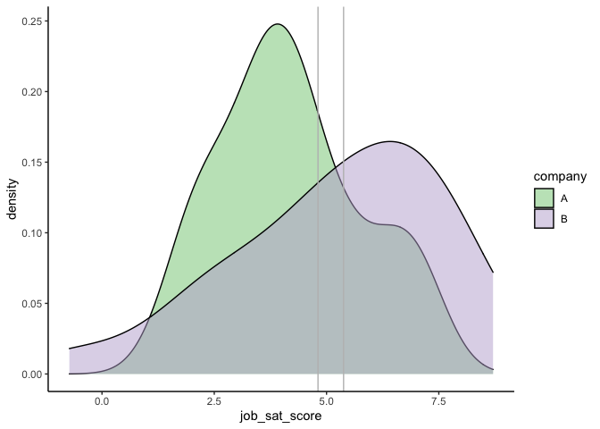

# Independent t-test 

**การเปรียบเทียบกลุ่ม 2 กลุ่มที่เป็นอิสระจากกัน**

### ข้อตกลงเบื้องต้นของ Independent t-test จะมีความคล้ายคลึงกับ One-sample t-test

การวิเคราะห์ผลโดยนำค่าเฉลี่ยจากกลุ่มตัวอย่าง (X̄1) ไปเปรียบเทียบกับค่าเฉลี่ยกลุ่มตัวอย่าง (X̄2) ข้อมูลของกลุ่มตัวอย่างจำเป็นต้องผ่านข้อตกลงเบื้องต้น หรือ (assumption)
ของการทดสอบสถิติดังกล่าว

ข้อตกลงเบื้องต้นของ Independent t-test มีดังนี้

    * ตัวแปรตาม (dependent variable) หรือตัวแปร criterion ควรอยู่ในรูปของตัวแปรต่อเนื่อง (see: levels of measurements) ไม่ว่าจะเป็นแบบ interval หรือ ratio

    * ตัวแปรต้น (independent variable) ควรมีลักษณะเป็นกลุ่มจำนวน 2 กลุ่ม

    * ข้อมูลมีความอิสระจากกัน (Independence; เราจะพบข้อตกลงนี้ในหลาย ๆ การทดสอบทางสถิติเพราะเป็นเรื่องที่สำคัญ, ดูเพิ่มเติมจาก concept) กล่าวคือ การออกแบบการเก็บข้อมูลจะต้องทำให้ไม่มีความสัมพันธ์ในกลุ่ม

    * ข้อมูลไม่ควรมีค่าสุดโต่ง (outliers) เพราะการใช้ค่าเฉลี่ย (mean) ในการคำนวณมีความเสี่ยงจะเกิดอคติสูง (see concept ทำไมถึงใช้ค่าเฉลี่ย)

    * ตัวแปรตาม (dependent variable) ควรอย่างน้อยมีโค้งเป็นปกติในแต่ละกลุ่ม แม้ว่าการทดสอบ t จะค่อนข้างแข็งแกร่ง (robust) ต่อการเบ้ของข้อมูลก็ตาม เราสามารถทดสอบได้ด้วย Shapiro-Wilk test of normality

    * ควรมี homogeneity of variance ซึ่งหมายความว่า residuals ของข้อมูลทั้งสองกลุ่มควรมีความอิสระจากกัน ซึ่งสามารถทดสอบได้โดยใช้ Levene's test

#### สร้างข้อมูลเปรียบเทียบกลุ่ม

>
> สมมติว่าพนักงานจากบริษัท A มีค่าเฉลี่ยของความพึงพอใจในการทำงานอยู่ที่ 5 จาก 1 - 7 likert scale ส่วนพนักงานจากบริษัท B มีค่าเฉลี่ยความพึงพอใจในงานอยู่ที่ 5.2
>

เราลองมาสร้างข้อมูลจากโจทย์กัน

``` r
A <- rnorm(23, mean = 5, sd = 1.8)
B <- rnorm(26, mean = 5.2, sd = 2.1)
# combine row
library(reshape2)
job_sat <- cbind(A, B)
job_sat <- melt(job_sat, id.vars = c("A", "B"))
colnames(job_sat) <- c("ID", "company", "job_sat_score")
head(job_sat)
````


    ##   ID company job_sat_score
    ## 1  1       A      4.524639
    ## 2  2       A      6.999153
    ## 3  3       A      2.226317
    ## 4  4       A      6.844786
    ## 5  5       A      3.591353
    ## 6  6       A      2.069014

**Note** ด้วยคำสั่ง `rnorm()` เราจะพบว่าค่าเฉลี่ยอาจจะไม่เท่ากับที่เก็บข้อมูลมา

ทดสอบข้อตกลงเบื้องต้น (assumption)

-   ค่าสุดโต่ง

``` r
    boxplot(job_sat_score ~ company, job_sat)
```


ในกราฟ `boxplot()` ไม่มีค่าสุดโต่ง

-   homogeneity of variances

```` r
    t.model <- aov(job_sat_score ~ company, job_sat)
    car::leveneTest(t.model)
```

    ## Levene's Test for Homogeneity of Variance (center = median)
    ##       Df F value Pr(>F)  
    ## group  1  3.1567 0.0817 .
    ##       50                 
    ## ---
    ## Signif. codes:  0 '***' 0.001 '**' 0.01 '*' 0.05 '.' 0.1 ' ' 1

การที่ผลไม่ significant หรือ Pr(&gt;F) ไม่น้อยกว่า 0.05 แปลว่าข้อมูลไม่ละเมิดข้อตกลงนี้ค่ะ

-   การทดสอบ Normality

``` r
    car::qqPlot(job_sat_score ~ company, job_sat)
```


ผลจาก `qqPlot()` ระบุถึงความเป็น normality

## การวิเคราะห์ผลโดยใช้ t.test()

เมื่อไม่พบข้อมูลที่ละเมิดข้อตกลงเบื้องต้น เราจะนำข้อมูลไปทดสอบ t ต่อไป

``` r
    t.test(job_sat_score ~ company, job_sat, var.equal = TRUE)
```

    ## 
    ##  Two Sample t-test
    ## 
    ## data:  job_sat_score by company
    ## t = -1.878, df = 50, p-value = 0.06622
    ## alternative hypothesis: true difference in means between group A and group B is not equal to 0
    ## 95 percent confidence interval:
    ##  -2.15183140  0.07230739
    ## sample estimates:
    ## mean in group A mean in group B 
    ##        4.195654        5.235416

เราจะพบว่าค่า t = 1.047 และ p job\_sat\_score อยู่ที่ 0.3 แปลว่า ไม่มีความแตกต่างกันระหว่างพนักงานในบริษัท A และ B

แต่ถ้าสมมติว่าเราทดสอบ Homogeneity Test แล้วพบว่า Variance ของสองกลุ่มไม่เท่ากัน เราสามารถงดใส่คำสั่ง var.equal = TRUE
หรือเปลี่ยนจาก TRUE เป็น FALSE

``` r
    t.test(job_sat_score ~ company, job_sat, var.equal = FALSE)
```


    ## 
    ##  Welch Two Sample t-test
    ## 
    ## data:  job_sat_score by company
    ## t = -1.878, df = 43.748, p-value = 0.06706
    ## alternative hypothesis: true difference in means between group A and group B is not equal to 0
    ## 95 percent confidence interval:
    ##  -2.15578291  0.07625889
    ## sample estimates:
    ## mean in group A mean in group B 
    ##        4.195654        5.235416

จะเห็นว่าผล output บรรทัดบนสุกเปลี่ยนไปเป็น

    Welch Two Sample t-test

แปลว่าเราเลือกใช้สถิติ Welch t-test ที่มีความแข็งแกร่ง (robust) ในการต่อสู้กับการไม่เท่ากันของ Variances มากกว่า ผลที่ออกมามีความคล้ายคลึงกัน ดูได้จาก Output ค่า

----

### สร้างกราฟให้ป็นนิสัยกัน

``` r
    library(ggplot2)
    ggplot(job_sat) +
      geom_density(aes(x = job_sat_score, fill = company), alpha = .5) +
      geom_vline(xintercept = 4.809946, color = "gray") +
      geom_vline(xintercept =  5.379535, color = "gray") +
                     theme_classic() +
                     scale_fill_brewer(palette="Accent") +
      scale_color_brewer(palette="Accent")
```



~ เธอเห็นเส้นตรงนั่นไหม ~ 
เส้นสองเส้นนั้นคือค่า Mean ของแต่ละกลุ่ม การที่กราฟซ้อนทับกันมาก แปลว่ากลุ่มตัวอย่างสองกลุ่มแทบไม่แตกต่างกันเลยค่ะ
