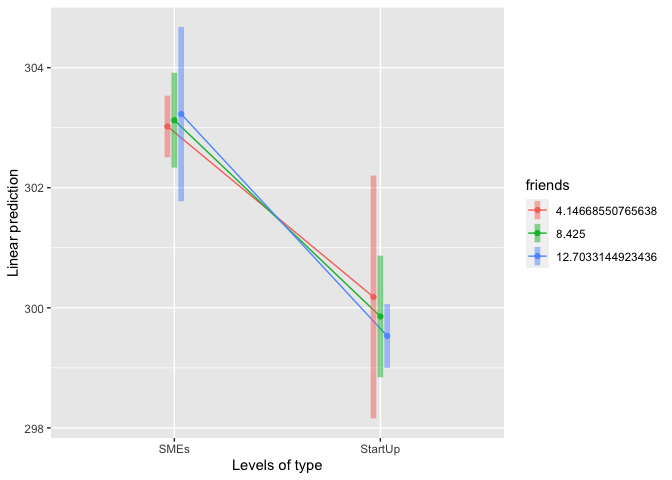
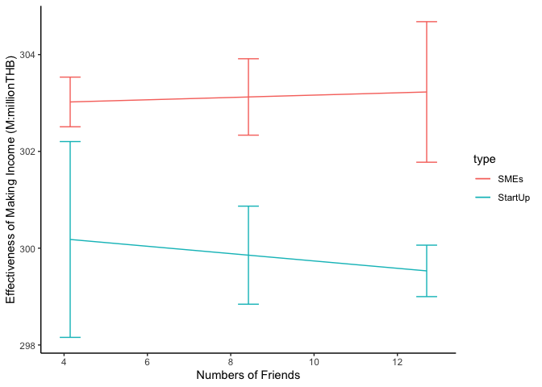
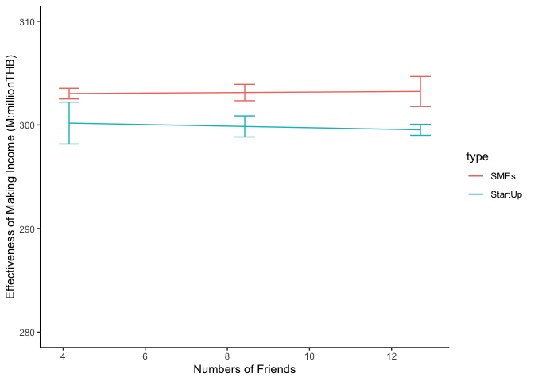

# Moderation Analysis

`Simple Moderation Analysis` หรือ การมีตัวแปรต้น (IV) อีก 1 ตัว (หรือ `W`) ที่สามารถทำให้ผลของตัวแปรตาม (DV) เปลี่ยนไป

การมีตัวแปร Moderation `(M or W)` หรือ ตัวแปรกำกับ จะแตกต่างจากเมื่อเราศึกษา two-way ANOVA ตรงที่ตัวแปรกำกับจะเป็นแบบ interval scale (หรือตัวแปรต่อเนื่อง) หรือแบบจัดกลุ่ม (factor) ก็ได้ ซึ่งเราจะสามารถใช้ตัวแปรกำกับในคำถามการวิจัยอย่างเช่น

`ความสามารถในการสร้างรายได้ใน SME ธรรมดา` และ `Start up Tech` “จะเปลี่ยนไปหรือไม่” เมื่อ `Circle of Friends` เพื่อนฝูงมีมากขึ้น

คำว่า **“จะเปลี่ยนไปหรือไม่”** คือเมื่อเปรียบเทียบระดับกลุ่ม `IV` แล้ว `W` ทำให้ `DV` ต่างออกไปจากเดิมไหม

เราจะลองสร้างชุดข้อมูลกันค่ะ

## DATA (based on my work)


``` r
type <- c(rep("SMEs", 120), rep("StartUp", 120))
income <- c(abs(rnorm(120, 303.321, sd = 2.6)), abs(rnorm(120, 300.111, sd = 3.1)))
friends <- c(round(abs(rnorm(120, 5, sd = 2.8))), round(abs(rnorm(120, 12, sd = 1.8))))
data <- data.frame(type, income, friends)
summary(data)
```


    ##      type               income         friends      
    ##  Length:240         Min.   :292.1   Min.   : 0.000  
    ##  Class :character   1st Qu.:299.3   1st Qu.: 5.000  
    ##  Mode  :character   Median :301.4   Median : 9.000  
    ##                     Mean   :301.3   Mean   : 8.425  
    ##                     3rd Qu.:303.5   3rd Qu.:12.000  
    ##                     Max.   :308.9   Max.   :16.000

``` r
psych::describe(data)
```


    ##         vars   n   mean   sd median trimmed  mad    min   max range  skew
    ## type*      1 240   1.50 0.50   1.50    1.50 0.74   1.00   2.0  1.00  0.00
    ## income     2 240 301.31 3.24 301.43  301.41 3.12 292.15 308.9 16.75 -0.21
    ## friends    3 240   8.43 4.28   9.00    8.55 5.93   0.00  16.0 16.00 -0.21
    ##         kurtosis   se
    ## type*      -2.01 0.03
    ## income     -0.15 0.21
    ## friends    -1.16 0.28


``` r
    table(data$type)
```
    ## 
    ##    SMEs StartUp 
    ##     120     120

### โมเดลสมการเส้นตรง

``` r
model <- lm(income ~ type * friends, data)
# or
model_aov <- aov(income ~ type * friends, data)
summary(model)
````
    ## 
    ## Call:
    ## lm(formula = income ~ type * friends, data = data)
    ## 
    ## Residuals:
    ##     Min      1Q  Median      3Q     Max 
    ## -9.2456 -1.7510  0.0981  1.7816  7.7832 
    ## 
    ## Coefficients:
    ##                      Estimate Std. Error t value Pr(>|t|)    
    ## (Intercept)         302.92130    0.50448 600.457   <2e-16 ***
    ## typeStartUp          -2.42632    1.62658  -1.492    0.137    
    ## friends               0.02414    0.08897   0.271    0.786    
    ## typeStartUp:friends  -0.10003    0.15577  -0.642    0.521    
    ## ---
    ## Signif. codes:  0 '***' 0.001 '**' 0.01 '*' 0.05 '.' 0.1 ' ' 1
    ## 
    ## Residual standard error: 2.753 on 236 degrees of freedom
    ## Multiple R-squared:  0.2864, Adjusted R-squared:  0.2773 
    ## F-statistic: 31.57 on 3 and 236 DF,  p-value: < 2.2e-16


ผลวิเคราะห์จะพบว่า จำนวนเพื่อไม่มีนัยสำคัญในการทำนายโมเดลนี้ ในขณะที่เมื่อเปรียบเทียบกับ `SMEs` แล้ว `StartUp` มีความแตกต่างจาก `SMEs` ในการทำนายความสามารถในการสร้างรายได้ -2.42 (แปลว่าน้อยกว่า `SMEs`) และการเปลี่ยนแปลงของความชันที่จำนวนกลุ่มเพื่อน = 1, และอยู่ในกลุ่ม `StartUp` จะพบว่ามีค่าน้อยกว่าเหมือนกัน (-0.1) แต่ไม่มีนัยสำคัญทางสถิติ

### การมองแบบระดับในตัวแปร Moderation ที่เป็นมาตรระดับหรือมีความต่อเนื่อง

ด้วยการมองภาพจำนวนเพื่อนเป็น scale มีความต่อเนื่อง เราจึงสามารถอธิบายได้เพียงว่า เมื่อจำนวนวงของเพื่อนเพิ่มขึ้น ความสามารถในการสร้างรายได้ไม่ได้มีความแตกต่างทางสถิติ

เพื่อความละเอียดและง่ายต่อการดูระดับของจำนวนกลุ่มของเพื่อน `(")` เราสามารถแบ่งกลุ่ม โดยใช้ค่า `SD` ที่ (`+1SD`) , กลาง (`Mean`), และต่ำ (`-1SD`)


``` r
# ใช้ library emmeans = estimated marginal means

library(emmeans)

Sdm1 <- mean(data$friends) - sd(data$friends)
Mean <- mean(data$friends)
Sdp1 <- mean(data$friends) + sd(data$friends)

# build emmeans objects
data.emm <- emmeans(model, ~ type | friends, at = list(friends = c(Sdm1, Mean, Sdp1)))
data.sum <- summary(data.emm)
data.sum
```


    ## friends =  4.147:
    ##  type    emmean     SE  df lower.CL upper.CL
    ##  SMEs     303.0 0.2605 236    302.5    303.5
    ##  StartUp  300.2 1.0268 236    298.2    302.2
    ## 
    ## friends =  8.425:
    ##  type    emmean     SE  df lower.CL upper.CL
    ##  SMEs     303.1 0.4007 236    302.3    303.9
    ##  StartUp  299.9 0.5142 236    298.8    300.9
    ## 
    ## friends = 12.703:
    ##  type    emmean     SE  df lower.CL upper.CL
    ##  SMEs     303.2 0.7370 236    301.8    304.7
    ##  StartUp  299.5 0.2699 236    299.0    300.1
    ## 
    ## Confidence level used: 0.95


พอเราจัดแยกกลุ่ม สูง กลาง และต่ำด้วยค่า `SD` แล้วจะพบค่าเฉลี่ยในกลุ่มของ `SMEs` และ `StartUp` ในแต่ละระดับของ `friends` ด้วย
### ทดสอบรายคู่ และ สร้างกราฟด้วย `emmeans::emmip()`


``` r
# compare group using method == pairwise == every group regardless
emmeans::contrast(data.emm, "pairwise", by = "friends")
```


    ## friends =  4.15:
    ##  contrast       estimate    SE  df t.ratio p.value
    ##  SMEs - StartUp     2.84 1.059 236 2.682   0.0078 
    ## 
    ## friends =  8.43:
    ##  contrast       estimate    SE  df t.ratio p.value
    ##  SMEs - StartUp     3.27 0.652 236 5.015   <.0001 
    ## 
    ## friends = 12.70:
    ##  contrast       estimate    SE  df t.ratio p.value
    ##  SMEs - StartUp     3.70 0.785 236 4.711   <.0001

และเมื่อเราวิเคราะห์แบบ pairwise comparison ในแต่ละระดับ จะพบว่า SMEs และ StartUp แตกต่างกันอย่างมีนัยสำคัญทุกระดับ


``` r
#seeing data by emmip()
emmip(model, friends ~ type, at = list(friends = c(Sdm1, Mean, Sdp1)), CIs = TRUE)
```



จากกราฟจะเห็นว่า เมื่อแบ่งกลุ่ม friends เป็น สูง กลาง และต่ำแล้ว ค่าของแต่ละกลุ่ม `SMEs` vs. `StartUp`

### ลองสร้างกราฟด้วย ggplot2 แล้วมองอีกมุมหนึ่ง

เราสามารถปรับมุมมองที่ใช้ในการมอง `IV` and `W` ได้ เพราะอย่าลืมว่า การพบกันของทั้งสองเป็นแบบ `IV*W` or `W*IV`

``` r
library(ggplot2)
ggplot(data.sum, aes(x = friends, y = emmean, color = type)) +
      geom_line(aes(color = type)) +
      geom_errorbar(aes(ymin = lower.CL, ymax = upper.CL), width = .5) +
      theme_classic() +
      xlab("Numbers of Friends") +
      ylab("Effectiveness of Making Income (M:millionTHB)")
```




**อย่าให้แกน y จกตาเราค่ะ เพิ่ม `ylim()` ลงไปเพื่อให้เห็นภาพกว้างขึ้น**


``` r
ggplot(data.sum, aes(x = friends, y = emmean, color = type)) +
      geom_line(aes(color = type )) +
      geom_errorbar(aes(ymin = lower.CL, ymax = upper.CL), width = .5) +
      theme_classic() +
      ylim(280, 310) +
      xlab("Numbers of Friends") +
      ylab("Effectiveness of Making Income (M:millionTHB)")
```



ประมาณนี้ค่า  
จริงๆ ต้องขอบพระคุณ **@kris-ariya** มากๆๆๆ
เพราะว่า แมวพยายามทำความเข้าใจในมิติของ `moderation` ตัวเดียวมานานมาก (เคยทำแต่ซับซ้อน) เพราะ simple มากก็ไปไม่เป็นเหมือนกัน


---
Back to [Datastist.com](www.datastist.com)
