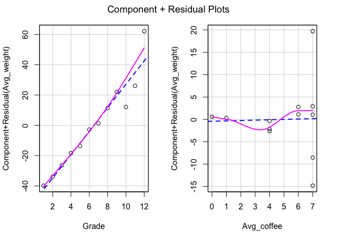
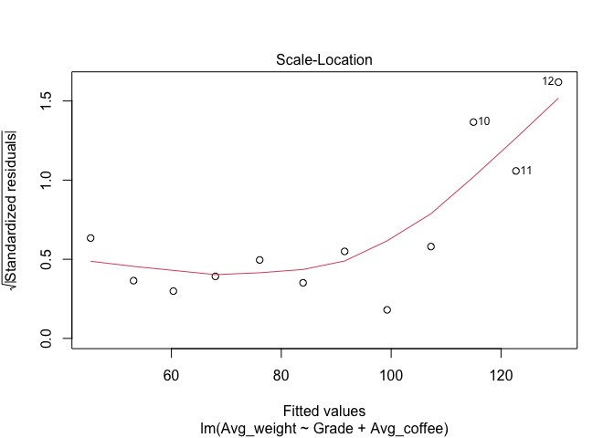
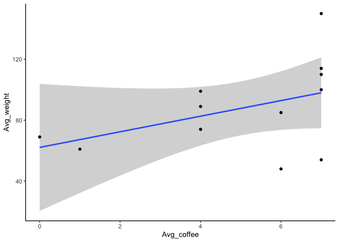

# Multiple Linear Regression

จากบท Simple Linear Regression เราคงรู้ว่าเมื่อตัวแปร x และ y มีความสัมพันธ์กัน (correlation) เราสามารถสร้างโมเดลถอดถอยในการทำนาย (predict) ได้

แต่บางครั้ง ตัวแปร x อาจจะมีหลายตัว เพราะบนโลกความเป็นจริง เราอาจต้องเก็บข้อมูลตัวแปรต่าง ๆ ที่เข้ากับโมเดลในทฤษฎีของเรา

บทเรียนนี้เราจะมาพูดถึงความสัมพันธ์ของ x1, x2 ที่มีต่อตัวแปร y กัน

    y^ = α + βx + ε
    α หมายถึง y-intercept หรือ จุดที่ข้อมูลตัดบนแกน y
    β หมายถึง ความชันของตัวแปร x
    ε หมายถึงerror ในโมเดล

ถ้าหากเรามีตัวแปร x 2 ตัว สมการจะเขียนได้ดังนี้

    y^ = α + βx1 + βx2 + ε

โดยการวิเคราะห์ Multiple Regression จะมีข้อตกลงเบื้องต้นไม่ต่างจาก Simple Regression 

> Linear relationship : คือ x และ y มีแนวโน้มที่จะเป็นเส้นตรง
> 
> Independence : คือการที่ residuals (ค่าหลงเหลือจากการขีดเส้นตรง) มีความแยกออกจากัน
> 
> Homoscedasticity : คือการที่ residuals มีความสม่ำเสมอในทุก ๆ ช่วงของ x
> 
> Normality : คือการที่ residuals มีโค้งปกติ Note* อันนี้คือค่า residuals ไม่ใช่ค่าข้อมูลนะ
> 
> Multi-collinearity : คือการที่ตัวแปร x มีความสัมพันธ์กันสูง จะทำให้ผลที่ได้มีความอคติ

แต่จะมีเพิ่มข้อตกลงเบื้องต้น 1 ข้อ เรียกว่า **Multi-collinearity**

แต่สำหรับการวิเคราะห์ใน R เราจำเป็นต้องเขียนสมการโมเดลก่อน ด้วยคำสั่ง `lm(y ~ x1 + x2, data)`

ในตัวอย่างนี้ เราจะใช้ data ที่เราสร้างขึ้น เรื่อง น้ำหนัก ชั้นเรียน และจำนวนกาแฟเฉลี่ยที่ดื่ม เหมือนเดิม
 
``` r
Grade <- 1:12
Avg_weight <- c(48, 54, 61, 69, 74, 85, 89, 99, 110, 100, 114, 150)
Avg_coffee <- c(6, 7, 1, 0, 4, 6, 4, 4, 7, 7, 7, 7)
data <- data.frame(Grade, Avg_weight, Avg_coffee)
head(data)
```

    ##   Grade Avg_weight Avg_coffee
    ## 1     1         48          6
    ## 2     2         54          7
    ## 3     3         61          1
    ## 4     4         69          0
    ## 5     5         74          4
    ## 6     6         85          6

    # เขียนโมเดล
    
``` r
model_multiple <- lm(Avg_weight ~ Grade + Avg_coffee, data = data)
```
### ทดสอบ Assumptions

* ทดสอบ Linear relationship

``` r
car::crPlots(model_multiple)
```



``` r
car::ncvTest(model_multiple)
```

    ## Non-constant Variance Score Test 
    ## Variance formula: ~ fitted.values 
    ## Chisquare = 10.19174, Df = 1, p = 0.0014107

* ทดสอบ Homoscedasticity

``` r
plot(model_multiple, 3)
```



* ทดสอบ Normality

``` r
car::qqPlot(model_multiple)
```
 

        ## [1] 10 12

* ทดสอบ Multi-collinearity จะทดสอบด้วย `vif()`

``` r
car::vif(model_multiple)
```

        ##      Grade Avg_coffee 
        ##   1.243642   1.243642


ปกติแล้วเราจะอนุญาตให้ vif มีค่าไม่เกิน 2.5 ถ้ามากกว่านั้น โดยเฉพาะมากกว่า 5.00 จะเรียกว่ามีความสัมพันธ์ที่ทับซ้อนกันเกินไป

_________


## การวิเคราะห์และอ่านผล Multiple Regression

เนื่องจากเราเขียนโมเดลด้วยคำสั่ง `lm()` ออกมาแล้ว และข้อตกลงเบื้องต้นไม่ได้ถูกละเมิดมากนัก ต่อไปเราจะวิเคราะห์ด้วยสมการถดถอยพหุและอ่านผลกันค่า

``` r
model_multiple <- lm(Avg_weight ~ Grade + Avg_coffee, data = data)
summary(model_multiple)
```

    ## 
    ## Call:
    ## lm(formula = Avg_weight ~ Grade + Avg_coffee, data = data)
    ## 
    ## Residuals:
    ##      Min       1Q   Median       3Q      Max 
    ## -14.9837  -2.1836   0.7683   1.4520  19.5484 
    ## 
    ## Coefficients:
    ##             Estimate Std. Error t value Pr(>|t|)    
    ## (Intercept) 37.06717    6.61555   5.603 0.000333 ***
    ## Grade        7.73396    0.82921   9.327 6.37e-06 ***
    ## Avg_coffee   0.08242    1.22057   0.068 0.947638    
    ## ---
    ## Signif. codes:  0 '***' 0.001 '**' 0.01 '*' 0.05 '.' 0.1 ' ' 1
    ## 
    ## Residual standard error: 8.892 on 9 degrees of freedom
    ## Multiple R-squared:  0.9237, Adjusted R-squared:  0.9067 
    ## F-statistic: 54.44 on 2 and 9 DF,  p-value: 9.387e-06

จะเห็นได้ว่าผลจะมีความแตกต่างจากผล simple regression ไม่มากนัก แต่มีตัวแปรขึ้นมาเพิ่ม ดังนั้น สมการของโมเดลนี้ คือ

    Y^ = intercept + coefx1(x1) + coefx2(x2) + e

เมื่อนำผลเข้าไปอยู่ในสมการแล้วจะพบว่า

    Y^ = 37.07 + 7.73(Grade) + 0.08(Avg_coffee) + e

อ่านผลได้ ดังนี้

-   เมื่อไม่สนใจตัวแปร Grade และ Avg\_coffee แล้ว ค่าเฉลี่ยของ
    Avg\_weight จะอยู่ที่ 37.07

-   เมื่อ Grade เพิ่มขึ้น 1 ปี จะทำให้ค่า Avg\_weight เพิ่มขึ้น 7.73
    กิโลกรัม อย่างมีนัยสำคัญทางสถิติ (เมื่อให้ Avg\_coffee คงที่)

-   เมื่อ Avg\_coffee เพิ่มขึ้น 1 แก้ว จะทำให้ค่า Avg\_weight เพิ่มขึ้น
    0.08 แต่ไม่มีนัยสำคัญทางสถิติ (เมื่อให้ Grade คงที่)

-   และโมเดลนี้สามารถอธิบายตัวแปรตามได้ 92.37 เปอร์เซ็นต์
    และเมื่อทดสอบด้วย F-test พบนัยสำคัญทางสถิติ p &lt; 0.001

ลูกแมวอาจจะถึงขั้นถอดใจเมื่อมาถึงจุดนี้ แต่อาจสรุปว่าตัวแปรที่ทำให้น้ำหนักเฉลี่ยเพิ่มขึ้นคือชั้นปี 

**โปรดระวัง** คำว่า “ทำให้” เพราะมันไม่ได้ทำให้ค่าข้อมูล Y ที่เราเก็บมาเพิ่มขึ้น แต่มันทำให้ Y^ หรือ Y ทำนายเพิ่มขึ้นจ้า


### Plot graph เป็นกิจวัตร

ใช้ `ggplot2` แบบแยกตัวแปร

``` r
library(ggplot2)

ggplot(data, aes(x = Avg_coffee, y = Avg_weight)) +
  geom_smooth(method = lm) +
  geom_point(stat = "identity") +
  theme_classic()
```



``` r
ggplot(data, aes(x = Grade, y = Avg_weight)) +
  geom_smooth(method = lm) +
  geom_point(stat = "identity") +
  theme_classic()
```


