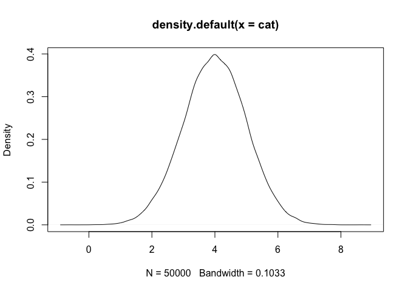
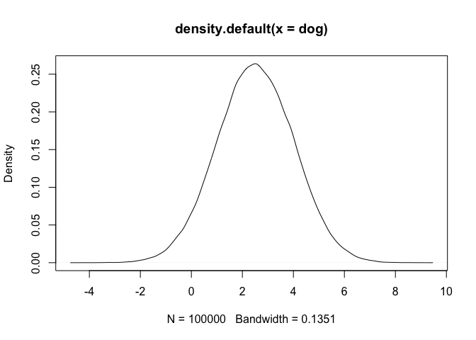
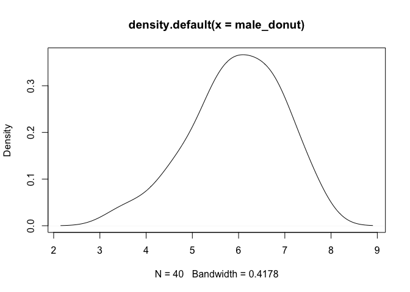
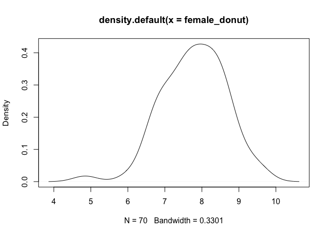

# Normal Distribution

## รู้จักข้อมูล (data)

บทนี้เราจะรู้จักคำว่า ข้อมูล หรือ data กัน ปกติแล้ว เวลาที่เราสนใจปัจจัยใด ๆ เราจะคาดประมาณค่าที่นักสถิติจะเรียกว่า `Parameter` นั่นคือค่าสรุปของกลุ่มประชากรที่เราต้องการจะศึกษา ในขณะที่
Sample (กลุ่มตัวอย่าง) จะหมายถึง กลุ่มตัวอย่างที่เราเลือก (หรือสุ่ม)มาจากประชากรนั่นเอง การที่เราเข้าใจความแตกต่างของข้อมูลประชากรทั้งหมด (parameter statistics) กับข้อมูลของกลุ่มตัวอย่าง (sample statistics) ของเราจะทำให้เราเข้าใจว่าทำไมข้อมูลที่มีข้อมูลตัวอย่างไม่เท่ากับจำนวนประชากร (ซึ่งเป็นไปได้ยากมากกกกก) สามารถนำมาวิเคราะห์ในทางสถิติได้

### ข้อมูลที่มาจากกลุ่มประชากร

ปกติข้อมูลจากตัวแปร (variable) ที่เราได้มาจากกลุ่มตัวอย่างโดยเฉพาะตัวแปรตาม(dependent variable) จะถูกสันนิษฐานว่าจะมีความเป็น Normally Distribution
ในกลุ่มประชากร หมายความว่า ข้อมูลในกลุ่มประชากรจะเป็นลักษณะของระฆังคว่ำ (เสมอในใจของนักสถิติ)

> สมมติว่าเรามีข้อมูลกลุ่มประชากรแมว 50,000 ตัว
> แมวมีค่าเฉลี่ยในการกินอาหารวันละ 4 ครั้ง และมีความคาดเคลื่อนคือ 1

``` r
cat <- rnorm(50000, mean = 4, sd = 1)
plot(density(cat))
```



ในกราฟ Density เราจะพบว่ามันมีความเป็น Normally Distributed

> สมมติว่าในประชากรสุนัข 100,000 ตัว สุนัขมีค่าเฉลี่ยในการกินอาหารวันละ
> 2.5 ครั้ง และมีความคาดเคลื่อนในประชากรคือ 1.5

``` r
dog <- rnorm(100000, mean = 2.5, sd = 1.5)
plot(density(dog))
```



เราก็จะเห็นได้ว่ากราฟเป็นแบบ Normally distributed เหมือนกัน

ในการ plot กราฟนี้ ความเป็นจริงคือมาจากสมการในการหาค่า z scores ของข้อมูลในแต่จุดของแกน X (แนวนอน) นั่นเอง

> **z &lt;- (X - μ)/σ**

ที่นี้!! กราฟที่เป็น Normally distributed นี่แหละ ที่จะทำให้เราวิเคราะห์เชิงสถิติต่าง ๆ ได้

### ข้อมูลที่มาจากกลุ่มตัวอย่าง (sample statistics)

สมมติว่า

> เราต้องการรู้ว่าประชากรผู้หญิงกับผู้ชายกินโดนัทเป็นสัดส่วนเท่าใด
> เราอาจจะอ่านงานวิจัยหนึ่งแล้ว นักวิจัยบอกเราว่า

> ผู้ชายกินโดนัทเฉลี่ย 6 ครั้งต่อสัปดาห์ ในกลุ่มตัวอย่างชาย 40 คน ในขณะที่ผู้หญิงกินโดนัทเฉลี่ย 8 ครั้งต่อสัปดาห์ ในกลุ่มตัวอย่างผู้หญิง 70 คน


สิ่งที่จะทำให้เราทราบถึงค่าความคาดเคลื่อนนี้คืออะไรก็คือค่าที่ความคลาดเคลื่อนที่มีอยู่ในกลุ่มตัวอย่างที่เราศึกษานั่นเอง ซึ่งเราสามารถประมาณค่านี้ได้จากค่าเฉลี่ย (x̄) ในแต่ละข้อมูลเชิงประจักษ์ของเราและ ความคลาดเคลื่อน (standard error; se)ของกลุ่มตัวอย่างนั่นเอง

```r
male_donut <- rnorm(40, mean = 6, sd = 1)
plot(density(male_donut))
```



``` r
female_donut <- rnorm(70, mean = 8, sd = 1)
plot(density(female_donut))
```


จากกราฟทั้งสองจะพบว่าเป็น normal distributed คล้ายกัน (ให้ *sd* = 1 จะได้ดูง่าย)

เนื่องจากความสำคัญของการเป็น Normal distribution ของข้อมูล การวิเคราะห์ทางสถิติหลายวิธียังมีความจำเป็นให้ข้อสันนิฐานนี้ตรงกับใจนักสถิติอยู่ ดังนั้นจึงมีการทดสอบต่าง ๆ ว่าค่าข้อมูลมีแนวโน้มจะออกนอกโค้งนี้ไหม ซึ่งเราจะเรียนในบทต่อไป เย้!

**Note** เนื่องจากข้อมูลที่เขียนขึ้นมาใช้หลักการของ normal distribution อยู่แล้ว ด้วยคำสั่ง `rnorm()` ถ้าเราไปเจอข้อมูลเชิงประจักษ์ที่เก็บมาจากกลุ่มตัวอย่างจริง ค่าความคาดเคลื่อนอาจะมีสูงต่ำแตกต่างไปจากข้อมูลในบทนี้นะ
