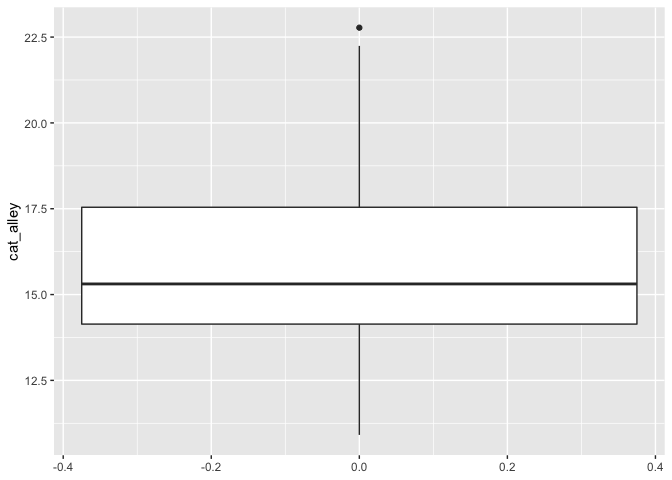
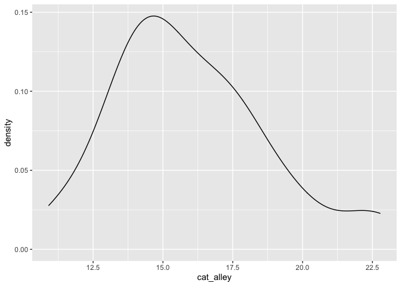

# One-sample t-test
การเปรียบเทียบค่าเฉลี่ยกลุ่มเมื่อรู้ค่าเฉลี่ยของกลุ่มประชากร

กลับมาที่ t-test ของเรา หลังจากที่ไปมึนอยู่กับ [Central Limit Theorem](https://amaiesc.github.io/study_r/CLT.html)

ในบทนี้ เราจะสร้างชุดข้อมูลง่าย ๆ ในการเปรียบกลุ่มประชากร ซึ่งหมายถึงการเปรียบเทียบค่าเฉลี่ยของกลุ่มตัวอย่าง (x-) กับค่าเฉลี่ยของประชากร ((μ)

สมมติว่า

> แมวทั้งโลกมี 6,000,000 ตัว และนอนวันละ 21 ชั่วโมง
> เราไปเก็บข้อมูลชั่วโมงที่แมวนอนแถวซอยบ้านเรามา 30 ตัว

``` r
set.seed(1990)
cat_alley <- rnorm(n = 30, mean = 16.78, sd = 3.4)
cat_alley <- as.data.frame(cat_alley)
summary(cat_alley)
```

    ##    cat_alley    
    ##  Min.   :10.91  
    ##  1st Qu.:14.14  
    ##  Median :15.31  
    ##  Mean   :15.97  
    ##  3rd Qu.:17.54  
    ##  Max.   :22.77


เราลองมา plot graph เล่น ๆ ดู

``` r
library(ggplot2)
ggplot(cat_alley, aes(y = cat_alley)) +
      geom_boxplot()
```



``` r
ggplot(cat_alley, aes(x = cat_alley)) +
      geom_density()
```



จะพบว่าข้อมูล cat\_alley ที่เก็บมามีความเป็น Normal Distribution

จากโจทย์
> แมวทั่วโลกมีค่าเฉลี่ยนอนวันละ 21 ชั่วโมง (μ)


## ข้อตกลงเบื้องต้นของ One-sample t-test

การวิเคราะห์ผลโดยนำค่าเฉลี่ยจากกลุ่มตัวอย่าง (x-) ไปเปรียบเทียบกับค่าเฉลี่ยประชาชน ข้อมูลของกลุ่มตัวอย่างจำเป็นต้องผ่านข้อตกลงเบื้องต้น หรือ (assumption) ของการทดสอบสถิติดังกล่าว

ข้อตกลงเบื้องต้นของ One-sample t-test มีดังนี้

* ตัวแปรตาม (dependent variable) หรือตัวแปร criterion ควรอยู่ในรูปของตัวแปรต่อเนื่อง (see: levels of measurements) ไม่ว่าจะเป็นแบบ interval หรือ ratio
>   จำนวนชั่วโมงที่แมวนอนเป็นแบบ ratio อยู่แล้ว
>
* ข้อมูลมีความอิสระจากกัน (Independence; เราจะพบข้อตกลงนี้ในหลาย ๆ การทดสอบทางสถิติเพราะเป็นเรื่องที่สำคัญ, ดูเพิ่มเติมจาก concept) กล่าวคือ การออกแบบการเก็บข้อมูลจะต้องทำให้ไม่มีความสัมพันธ์ในกลุ่ม
> สมมติว่าเก็บข้อมูลแบบสุ่มสมบูรณ์ (complete randomization)
> 
* ข้อมูลไม่ควรมีค่าสุดโต่ง (outliers) เพราะการใช้ค่าเฉลี่ย (mean) ในการคำนวณมีความเสี่ยงจะเกิดอคติสูง (see concept ทำไมถึงใช้ค่าเฉลี่ย)
> จากกราฟ boxplot() ดูเหมือนจะไม่มีค่าสุดโต่ง
> (ทดสอบได้โดยใช้ +-3SD)
>
* ตัวแปรตาม (dependent variable) ควรอย่างน้อยมีโค้งเป็นปกติ แม้ว่าการทดสอบ t จะค่อนข้างแข็งแกร่ง (robust) ต่อการเบ้ของข้อมูลก็ตาม เราสามารถทดสอบได้ด้วย Shapiro-Wilk test of normality
> ดูจาก plot(density()) ก็มีความโค้งปกติอยู่ อาจจะใช้ car::qqPlot(data) ร่วมด้วยก็ได้

## การวิเคราะห์ผลสถิติ t แบบ one-sample

สมมติฐานว่างของเราในที่นี้คือ

    Ho : μ = 21 
    or
    Ho : μ - 21 = 0

เมื่อทดสอบด้วยสถิติ t จะพบว่า

``` r
t.test(cat_alley, mu = 21)
```

    ## 
    ##  One Sample t-test
    ## 
    ## data:  cat_alley
    ## t = -9.7915, df = 29, p-value = 1.062e-10
    ## alternative hypothesis: true mean is not equal to 21
    ## 95 percent confidence interval:
    ##  14.92281 17.02292
    ## sample estimates:
    ## mean of x 
    ##  15.97286

ผลจากการวิเคราะห์ t.test() พบว่า
แมวในซอยบ้านเรามีชั่วโมงนอนเฉลี่ยแตกต่างจากแมวทั่วโลกอย่างมีนัยสำคัญทางสถิติที่ค่า t(1, 29) = -9.79, p < 0.001 ค่ะ


______
Happy Coding ka
สามารถกดติดตามและ subscribe ได้ที่ [datastist.com](http://www.datastist.com)
