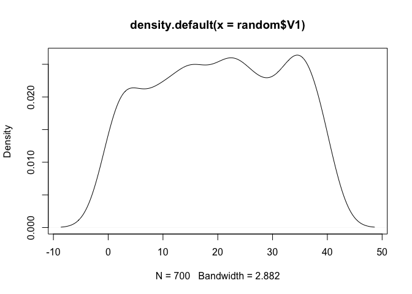
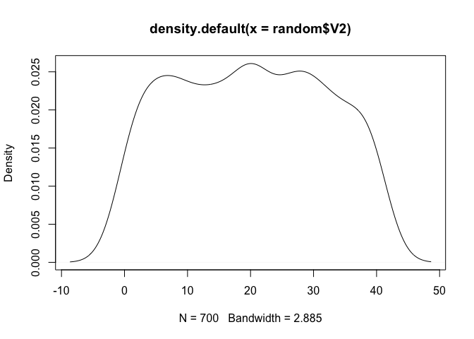
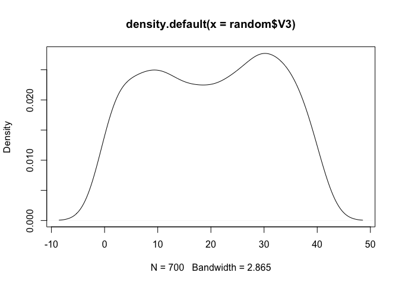
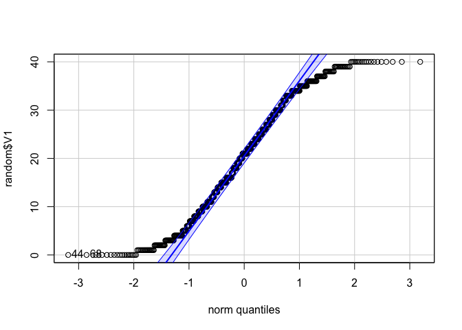
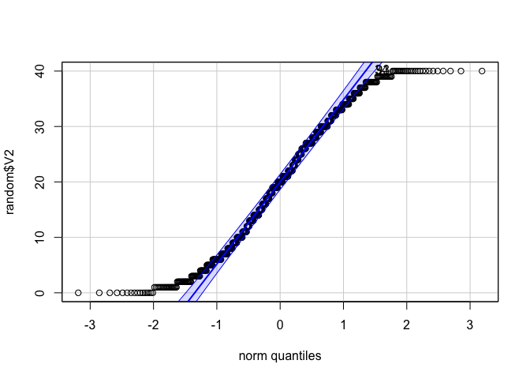
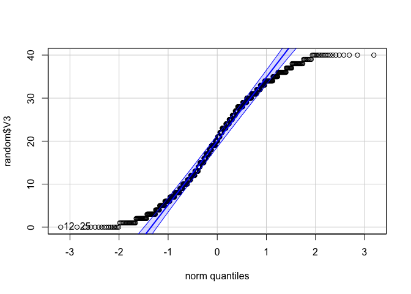
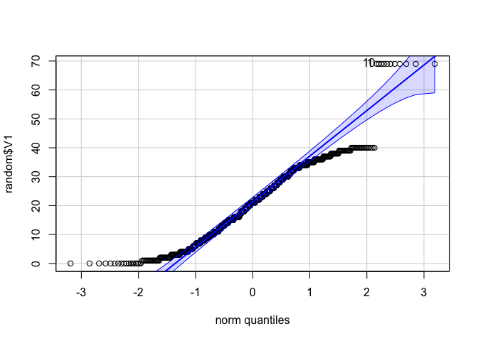
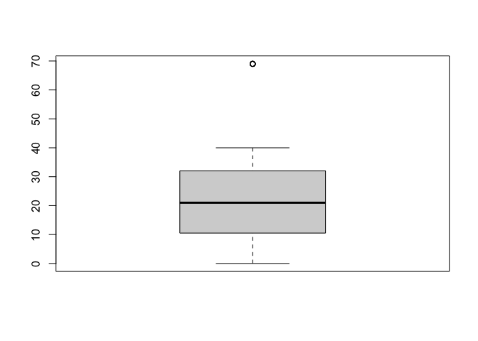

# Normal distribution in Real Dataset

จากบทที่แล้ว เราเริ่มรู้ว่าทำไมนักวิจัยหรือนักสถิติ (ที่ใช้สถิติบางประเภท) มีข้อตกลงเบื้องต้นว่าข้อมูลควรจะมีแนวโน้มเข้าสู่ศูนย์กลาง (normally
distributed) บทนี้เราจะมาลอง dataset จริงจากการสร้างชุด data ขึ้นมา โดยการสุ่มเลขและใช้ package ชื่อว่า `random`

``` r
install.packages("random")
library("random")
random <- as.data.frame(randomNumbers(n = 2100, min = 0, max = 40, col = 3))
head(random) 
```

    ##   V1 V2 V3
    ## 1  4  1 33
    ## 2 30 27 34
    ## 3 33 26 14
    ## 4 33 12 13
    ## 5 17 24 22
    ## 6 38  0  1


``` r
summary(random)
```
    ##        V1              V2              V3       
    ##  Min.   : 0.00   Min.   : 0.00   Min.   : 0.00  
    ##  1st Qu.:10.00   1st Qu.:10.00   1st Qu.:10.00  
    ##  Median :21.00   Median :20.00   Median :20.00  
    ##  Mean   :20.44   Mean   :19.92   Mean   :20.07  
    ##  3rd Qu.:31.00   3rd Qu.:30.00   3rd Qu.:30.00  
    ##  Max.   :40.00   Max.   :40.00   Max.   :40.00


เราจะได้ dataset 1 ชุดที่มี 3 คอลลัมภ์ (V1, V2, V3) ถ้าเราลองนำข้อมูลในแต่ละคอลลัมภ์มา plot `density` graph

``` r
den_V1 <- plot(density(random$V1))
```



``` r
den_V2 <- plot(density(random$V2))
```



``` r
den_V3 <- plot(density(random$V3))
```




ถามว่าโค้งปกติไหม ตอนนี้อาจจะดูงง ๆ สุด ๆ แต่เราสามารถทดสอบได้ด้วยคำสั่ง `qqPlot()` จาก package `car` \*P ตัวใหญ่

``` r
library(car)
qqPlot(random$V1)
```



    ## [1] 44 68

``` r
qqPlot(random$V2)
```



    ## [1] 34 93

``` r
qqPlot(random$V3)
```



    ## [1] 12 25

จะเห็นได้ว่า ข้อมูลเรียบเคียงไปตามเส้นที่ควรจะเป็น

แต่ถ้าเราอยากเห็นว่าถ้ามี data ที่สุดโต่งขึ้นมา (outliers) จะเป็นอย่างไร
เราจะลองใส่ข้อมูลใน data ที่เรามีอยู่

``` r
random[c(1, 10, 20, 30, 40, 50, 60, 70, 80, 90, 100), "V1"] <- 69
qqPlot(random$V1)
```



    ## [1]  1 10

ที่นี้เราจะเห็นชัดมากขึ้นว่า `Q-Q plot`เราเริ่มงงตัวมันเองแล้ว

ถ้าจะให้ชัดเจนเมื่อข้อมูลมี`Outliers` หรือ ค่าสุดโต่ง
เราสามารถที่จะสร้างกราฟด้วยคำสั่ง `boxplot()` ได้

``` r
boxplot(random$V1)$out
```



    ##  [1] 69 69 69 69 69 69 69 69 69 69 69

พอเป็น `boxplot()`เราก็จะเห็นชัดเจนขึ้นมากว่าค่าสุดโต่งคือเลข 69

การแทนที่ค่าสุดโต่งหรือกำจัดออกไปขึ้นอยู่กับสายงานวิจัยของเรา การวิจัยทางจิตวิทยาอาจให้ตัดค่าที่มีค่าสูงกว่า +3SD หรือ -3SD เราจะไปพูดถึงอีกทีในการทำความสะอาดข้อมูล (data cleaning)ค่า~
