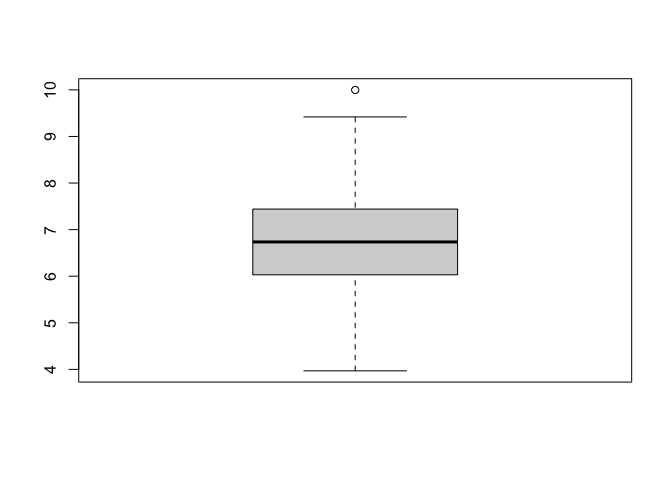
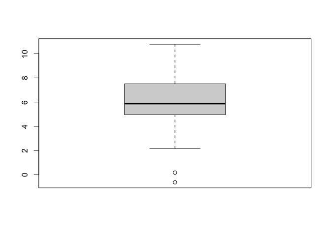
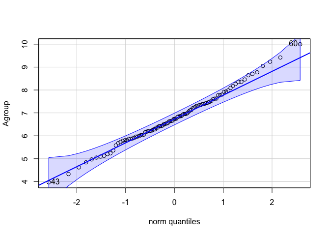
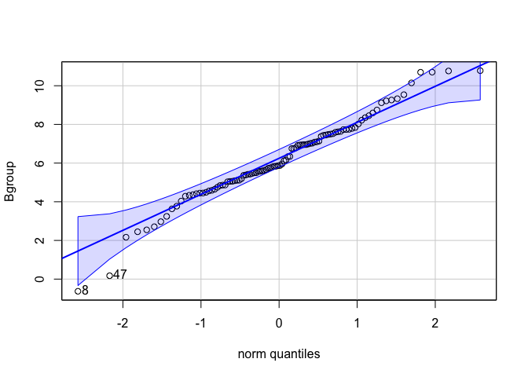
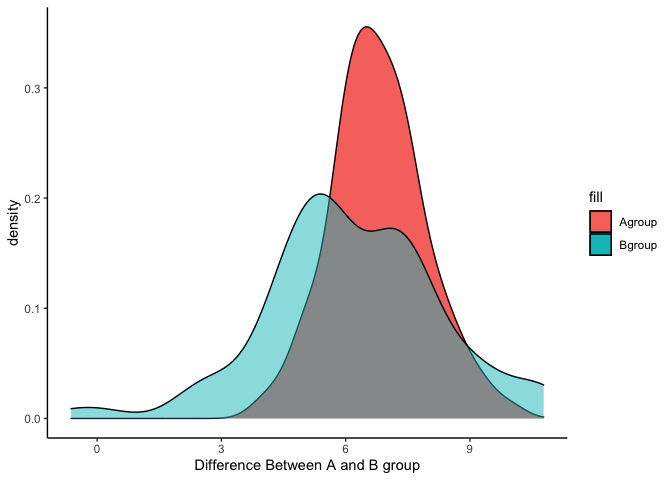

# Dependent t-test

#### การทดสอบ Dependent t-test หรือ paired-sample t-test คือการทดสอบค่าเฉลี่ยของกลุ่มสองกลุ่มที่ไม่เป็นอิสระจากกัน

> 
> *“ไม่เป็นอิสระจากกัน คืออัลลลลไลลลล?”*

ความไม่เป็นอิสระจากกันคือการที่ค่า x1 ในกลุ่ม 1 มีความสัมพันธ์กับ x1
ในกลุ่ม 2 เช่น

    การเก็บข้อมูล Job Satisfaction ก่อนเข้า Training และ หลังการเข้า training

เราจะเรียกการทดสอบข้อมูลนี้ว่า repeated-measure t-test

หรือ

    relationship Satisfaction เมื่อคะแนนเป็นของ สามี และ ภรรยา

## ข้อตกลงเบื้องต้นของ Dependent t-test

ข้อตกลงเบื้องต้นของ Dependent t-test จะมีความคล้ายคลึงกับ Independent t-test

การวิเคราะห์ผลโดยนำค่าเฉลี่ยจากกลุ่มตัวอย่าง (X̄1a) ไปเปรียบเทียบกับค่าเฉลี่ยกลุ่มตัวอย่าง (X̄1b) ข้อมูลของกลุ่มตัวอย่างจำเป็นต้องผ่านข้อตกลงเบื้องต้น หรือ (assumption)
ของการทดสอบสถิติดังกล่าว

ข้อตกลงเบื้องต้นของ Dependent t-test มีดังนี้

\* ตัวแปรตาม (dependent variable) หรือตัวแปร criterion
ควรอยู่ในรูปของตัวแปรต่อเนื่อง (see: levels of measurements)
ไม่ว่าจะเป็นแบบ interval หรือ ratio

\* ตัวแปรต้น (independent variable) ควรมีลักษณะเป็นกลุ่มจำนวน 2 กลุ่ม
ที่มีความเป็นคู่กันอย่างตัวอย่างข้างต้น

\* ข้อมูลไม่ควรมีค่าสุดโต่ง (outliers) เพราะการใช้ค่าเฉลี่ย (mean)
ในการคำนวณมีความเสี่ยงจะเกิดอคติสูง (see concept ทำไมถึงใช้ค่าเฉลี่ย)

\* ตัวแปรตาม (dependent variable) ควรอย่างน้อยมีโค้งเป็นปกติในแต่ละกลุ่ม
แม้ว่าการทดสอบ t จะค่อนข้างแข็งแกร่ง (robust) ต่อการเบ้ของข้อมูลก็ตาม
เราสามารถทดสอบได้ด้วย Shapiro-Wilk test of normality

เรามาสร้างข้อมูลกัน

> สมมติว่า เราเป็นนักวิจัย ไปสอบถามความพึงพอใจในคู่ของตัวเอง โดยถามฝ่าย
> a และฝ่าย b (ที่ใช้ a,b เพราะต้อนรับสู่สังคม LGBTQ ค่า~)
> ได้คะแนนเฉลี่ยมาดังนี้
>
> X̄a = 6.926
> X̄b = 6.298;
> scale 1 - 10 Likert

``` r
    set.seed(1990)
    Agroup <- rnorm(100, mean = 7.12, sd = 1.2)
    Bgroup <- rnorm(100, mean = 6.25, sd = 2.1)
    summary(Agroup)
```


    ##    Min. 1st Qu.  Median    Mean 3rd Qu.    Max. 
    ##   3.968   6.032   6.736   6.789   7.435   9.998


``` r
    summary(Bgroup)
```


    ##    Min. 1st Qu.  Median    Mean 3rd Qu.    Max. 
    ## -0.6295  4.9916  5.8712  6.1806  7.5041 10.7801

จากนั้นเราจะลองไปทดสอบข้อตกลงเบื้องต้นกันค่ะ

-   Outliers
``` r
boxplot(Agroup)
```



``` r
boxplot(Bgroup)
```


จะเห็นว่ามีจุดสีขาวโผล่ขึ้นมาในกราฟ `boxplot()` ถ้าเราต้องการทดสอบ เราสามารถอ้างอิงจาก boxplot ด้วยการเขียน

``` r
boxplot(Agroup)$out
```


    ## [1] 9.99805

``` r
boxplot(Bgroup)$out
```



    ## [1] -0.6294601  0.1734488

ก่อนที่จะทำการจัดการข้อมูลนี้ เรามาดูว่า 2 ข้อมูลนี้ละเมิดข้อตกลงอื่นด้วยหรือไม่

-   ความเป็น normality

``` r
car::qqPlot(Agroup)
```



    ## [1] 60 43

``` r
car::qqPlot(Bgroup)
```



    ## [1]  8 47

ดูจาก qqPlot แล้วเหมือนจะไม่มีปัญหาเท่าไหร่นะ

## เราจะมาเริ่มทดสอบ dependent t กันค่ะ

``` r
t.test(Agroup, Bgroup, paired = TRUE)
```

    ## 
    ##  Paired t-test
    ## 
    ## data:  Agroup and Bgroup
    ## t = 2.5734, df = 99, p-value = 0.01155
    ## alternative hypothesis: true difference in means is not equal to 0
    ## 95 percent confidence interval:
    ##  0.1393124 1.0775929
    ## sample estimates:
    ## mean of the differences 
    ##               0.6084527


ผล Output ของ R บอกเราว่าฝั่ง A กับฝั่ง B
เค้ามีความพึงพอใจในความสัมพันธ์ (relationship satisfaction)
แตกต่างกันที่ t(1,99) = 2.5734, p &lt; 0.05
มีความแตกต่างของค่าเฉลี่ยอยู่ที่ 0.608

> ตอนนี้ก็ไม่รู้ว่าฝั่ง A ได้ยินข้อมูลนี้แล้วจะรู้สึกยังไงบ้างเนอะ
> บางทีรักของเราก็ไม่เท่ากันเนอะ......... T^T
> 

### สร้างกราฟให้เป็นนิสัยกันดีกว่า

``` r
    # ทำให้เป็น data.frame ก่อน
    group <- data.frame(Agroup, Bgroup)
    library(ggplot2)
    ggplot(group) +
      geom_density(aes(x = Agroup, fill = "Agroup")) +
      geom_density(aes(x = Bgroup, fill = "Bgroup"), alpha = 0.5) +
      xlab("Difference Between A and B group") +
      theme_classic()
```



จะเห็นได้ว่าพื้นที่สีเทาคือจุดกราฟซ้อนกันบนช่วงค่าเฉลี่ยที่คร่อมกัน
