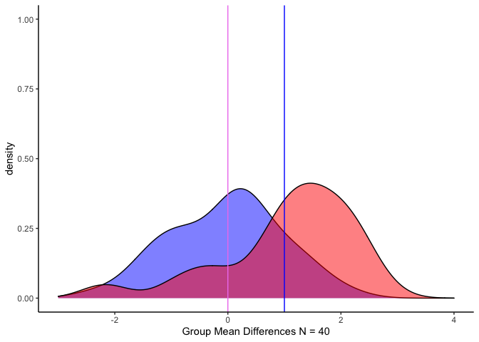
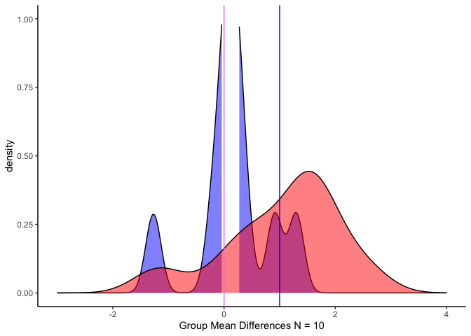
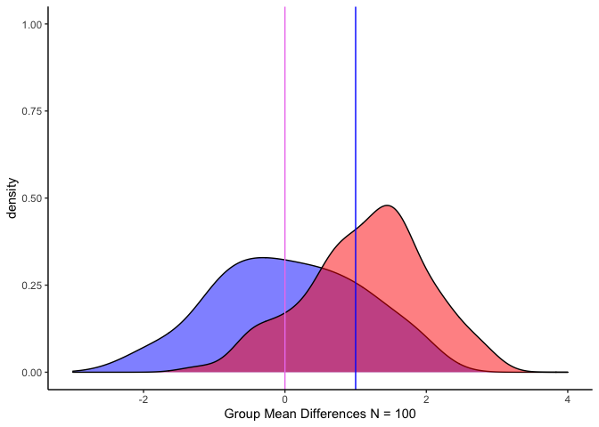
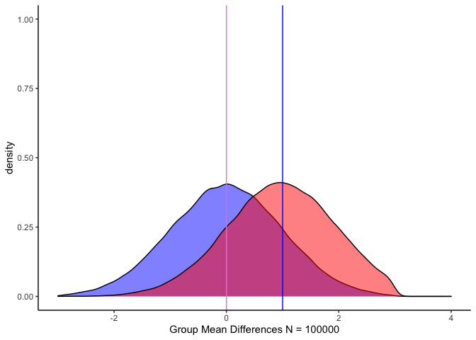
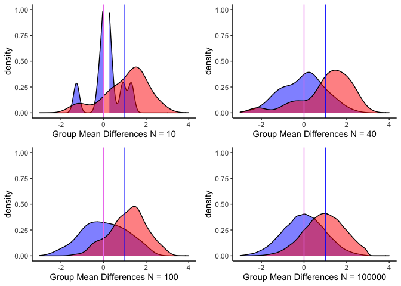

# Practical Vs. Statistical Significance

ในการวิเคราะห์ทางสถิติ ส่วนหนึ่งที่สำคัญมากในการตัดสินใจว่าเราจะปฎิเสธสมมติฐานว่าง หรือ `Null Hypothesis` หรือไม่นั้นก็คือ Power, alpha และ effect size อย่างที่เคยกล่าวมาก่อนหน้านี้

ปกติแล้วทางสัมคมศาสตร์จะให้ค่าแอลฟ่าอยู่ที่ 0.05 และให้ค่า Power อยู่ที่ 0.8 การให้ค่าแต่ละพารามิเตอร์แบบนี้จะช่วยให้การเกิด False Positive มีน้อยลง แต่ว่า effect size ผู้วิจัยจะเป็นคนกำหนดจากงานวิจัยก่อนหน้า หรือตั้งไว้ให้เล็กสำหรับจิตวิทยาและสายสังคมศาสตร์ และการคำนวณกลุ่มตัวอย่างจะเกิดขึ้นเมื่อมีพารามิเตอร์ดังกล่าวครบแล้ว

## แล้วจำนวนกลุ่มตัวอย่างสำคัญอย่างไร

จำนวนกลุ่มตัวอย่างมีความสัมพันธ์กับ effect size ในมุมที่ทฤษฎีมองไม่เห็นแต่ทางสถิติ ถือเป็นเรื่องสำคัญมากเพราะการถึงระดับนัยสำคัญทางสถิติ
(statistical significance) ไม่ได้บ่งบอกถึงการนำไปใช้ได้ในโลกความจริงเสมอไป หรือ ที่เรียกว่า
practical significance

**ตัวอย่าง**
  
  โดยปกติแล้ววิธีทดสอบค่าเฉลี่ยกลุ่มโดยการทดสอบ t จะมีกลุ่มตัวอย่างประมาณ 25 - 30 คน เราจะกำหนดให้ค่าเฉลี่ยประมาณ
*Note* เพราการสร้างค่าข้อมูลจากคำสั่งใน R เป็นการสุ่ม อาจจะไม่ตรงกับที่ต้องการอย่างเฉพาะเจาะจง) กลุ่ม a = 1 และ กลุ่ม b = 2 โดยที่มีค่าเบี่ยงเบนมาตรฐาน = 1

#### ตัวอย่างที่ 1


``` r
set.seed(123321) #ตั้งค่าการสุ่ม
library(truncnorm) #package ในการช่วยสุ่มค่า)
N40a <- round(rtruncnorm(40, a = -3, b = 3, mean = 0, sd = 1), 2) # สุ่มเลขออกมาให้ได้ 40 ตัวอย่าง
N40b <- round(rtruncnorm(40, a = -3, b = 3, mean = 1, sd = 1), 2)

t.test(N40a, N40b, var.equal = TRUE, alternative = "less") # ใช้ independent t ในการทดสอบ
```


    ## 
    ##  Two Sample t-test
    ## 
    ## data:  N40a and N40b
    ## t = -4.5302, df = 78, p-value = 1.045e-05
    ## alternative hypothesis: true difference in means is less than 0
    ## 95 percent confidence interval:
    ##        -Inf -0.6958026
    ## sample estimates:
    ## mean of x mean of y 
    ##  -0.03575   1.06425


จะเห็นได้ว่า เมื่อมีกลุ่มตัวอย่าง 2 กลุ่ม แล้วเราต้องการเปรียบเทียบค่าเฉลี่ยของสองกลุ่มนี้
โดยที่แต่ละกลุ่มมีจำนวนตัวอย่าง 40 คน เราจะได้ค่า t = -4.53 และถึงนัยสำคัญทางสถิติที่ p &lt; 0.001

การทดสอบ t critical value จะทดสอบโดยใช้ ค่า Degree of freedom และค่า alpha ที่เราตั้งไว้ ในกรณีตัวอย่าง degree of freedom จะเท่ากับ (n-1)\*k = 78 (k คือจำนวนกลุ่ม) และ alpha = 0.05 ซึ่งค่า Critical value (1-tailed) = 1.685

#### ตัวอย่างที่ 2 กลุ่มตัวอย่างมีกลุ่มละ 10 คน

``` r
N10a <- round(rtruncnorm(10, a = -3, b = 3, mean = 0, sd = 1), 2)
N10b <- round(rtruncnorm(10, a = -3, b = 3, mean = 1, sd = 1), 2)
t.test(N10a, N10b, var.equal = TRUE)
```

    ## 
    ##  Two Sample t-test
    ## 
    ## data:  N10a and N10b
    ## t = -2.2322, df = 18, p-value = 0.03854
    ## alternative hypothesis: true difference in means is not equal to 0
    ## 95 percent confidence interval:
    ##  -1.71405712 -0.05194288
    ## sample estimates:
    ## mean of x mean of y 
    ##     0.164     1.047

เมื่อเราลดกลุ่มตัวอย่างให้เหลือเพียง 10 คน แต่คงค่าเฉลี่ยไว้เท่าเดิม เราจะพบว่าค่าทดสอบ t = -2.23 และพบนัยสำคัญทางสถิติ ที่ p &lt; 0.05

#### ตัวอย่างกลุ่มที่ 3

``` r
N100a <- round(rtruncnorm(100, a = -3, b = 3, mean = 0, sd = 1), 2)
N100b <- round(rtruncnorm(100, a = -3, b = 3, mean = 1, sd = 1), 2)
t.test(N100a, N100b, var.equal = TRUE)
```

    ## 
    ##  Two Sample t-test
    ## 
    ## data:  N100a and N100b
    ## t = -8.1148, df = 198, p-value = 5.053e-14
    ## alternative hypothesis: true difference in means is not equal to 0
    ## 95 percent confidence interval:
    ##  -1.3531448 -0.8240552
    ## sample estimates:
    ## mean of x mean of y 
    ##    0.0539    1.1425

เมื่อเราเพิ่มกลุ่มตัวอย่างเป็น 100 คนทั้งสองกลุ่ม และคงค่าเฉลี่ยไว้ (SD = 1) ค่าของการทดสอบ t = -8.11 และพบนัยสำคัญทางสถิติที่ p &lt; 0.001

#### ทำไมจึงเป็นเช่นนี้

ในกรณีการพบนัยสำคัญแต่เป็น false positive หรือ Type I error (คือไม่มีความแตกต่างแต่ไปสรุปว่ามีความแตกต่าง) สามารถแยกได้ 2 กรณีคือ

1.  ข้อมูลน้อยเกินไปจนค่าที่ผ่านการทดสอบ t เป็นการสุ่มข้อมูลที่น้อยเกินไปทำให้ค่าห่างของข้อมูลสามารถตกไปอยู่ในบริเวณที่เราอนุญาตให้เกิด error ได้ หรืออาจจะไม่ตกลงไปเลยก็ได้ (ในกรณีตัวอย่าง เราควบคุมให้ SD = 1 แล้ว)
2.  ข้อมูลที่มากเกินไปทำให้ช่วงกว้างของความแตกต่างมากขึ้น และค่าทดสอบ t เฟ้อ เพราะการทดสอบโดยเฉพาะการเปรียบเทียบค่าเฉลี่ยกลุ่มจะไวต่อจำนวนกลุ่มตัวอย่างพอสมควร

### อธิบายผ่านกราฟ

``` r
library(ggplot2) #สร้างกราฟด้วย ggplot2
N40 <- data.frame(N40a, N40b)
medium <- ggplot(N40) +
  geom_density(aes(x = N40a), fill = "blue", alpha = 0.5) +
  geom_density(aes(x = N40b), fill = "Red", alpha = 0.5) +
  xlab("Group Mean Differences N = 40") +
  xlim(-3, 4) +
  ylim(0, 1) +
  geom_vline(xintercept = 0, color = "violet") +
  geom_vline(xintercept = 1, color = "blue") +
  theme_classic()
medium
```



กราฟเมื่อกลุ่มตัวอย่างละกลุ่ม = 40 และค่าเฉลี่ยกลุ่ม a = สีม่วง, b = สีน้ำเงิน, SD = 1

``` r
N10 <- data.frame(N10a, N10b)
small <- ggplot(N10) +
  geom_density(aes(x = N10a), fill = "blue", alpha = 0.5) +
  geom_density(aes(x = N10b), fill = "Red", alpha = 0.5) +
  xlab("Group Mean Differences N = 10") +
  xlim(-3, 4) +
  ylim(0, 1) +
  geom_vline(xintercept = 0, color = "violet") +
  geom_vline(xintercept = 1, color = "blue") +
  theme_classic()
small
```




กราฟเมื่อกลุ่มตัวอย่างละกลุ่ม = 10 และค่าเฉลี่ยกลุ่ม a = สีม่วง, b = สีน้ำเงิน, SD = 1

``` r
N100 <- data.frame(N100a, N100b)
big <- ggplot(N100) +
  geom_density(aes(x = N100a), fill = "blue", alpha = 0.5) +
  geom_density(aes(x = N100b), fill = "Red", alpha = 0.5) +
  xlab("Group Mean Differences N = 100") +
  xlim(-3, 4) +
  ylim(0, 1) +
  geom_vline(xintercept = 0, color = "violet") +
  geom_vline(xintercept = 1, color = "blue") +
  theme_classic()
big
```



กราฟเมื่อกลุ่มตัวอย่างละกลุ่ม = 100 และค่าเฉลี่ยกลุ่ม a = สีม่วง, b = สีน้ำเงิน, SD = 1

จะเห็นได้ว่า เมื่อเปรียบเทียบ**พื้นที่ส่วนที่ทับซ้อนกัน (สีแดง)** ใน**กรอบของค่าเฉลี่ย (เส้นสีม่วงและเส้นสีน้ำเงิน)** จะพบว่าแตกต่างกัน

#### ถ้าเราเพิ่มกลุ่มตัวอย่าง = 100,000 คน

``` r
N100000a <- round(rtruncnorm(100000, a = -3, b = 3, mean = 0, sd = 1), 2)
N100000b <- round(rtruncnorm(100000, a = -3, b = 3, mean = 1, sd = 1), 2)
t.test(N100000a, N100000b, var.equal = TRUE)
```
## 
##  Two Sample t-test
## 
## data:  N100000a and N100000b
## t = -217.93, df = 2e+05, p-value < 2.2e-16
## alternative hypothesis: true difference in means is not equal to 0
## 95 percent confidence interval:
##  -0.9480150 -0.9311152
## sample estimates:
## mean of x mean of y 
## 0.0025797 0.9421448

ถ้าเราเพิ่มจำนวนกลุ่ม ไปเรื่อย ๆ โดยให้ค่าเฉลี่ยและ SD คงเดิมเราจะพบว่าค่าทดสอบ t เพิ่มขึ้นมาก (t = -168.38) และเมื่อลองวาดกราฟ กราฟ
Density จะสวยงามมาก ในขณะที่พื้นที่ใต้กราฟในส่วนของความแตกต่างน้อยลงเรื่อย ๆ

``` r
N100000 <- data.frame(N100000a, N100000b)
Non.pratical <- ggplot(N100000) +
  geom_density(aes(x = N100000a), fill = "blue", alpha = 0.5) +
  geom_density(aes(x = N100000b), fill = "Red", alpha = 0.5) +
  xlab("Group Mean Differences N = 100000") +
  xlim(-3, 4) +
  ylim(0, 1) +
  geom_vline(xintercept = 0, color = "violet") +
  geom_vline(xintercept = 1, color = "blue") +
  theme_classic()
Non.pratical
```



จะเห็นว่ากราฟมีความสวยงามมาก แต่ว่า effect size ก็เล็กมากเหมือนกัน ถ้าเรานำกราฟมาเปรียบเทียบกัน

``` r
gridExtra::grid.arrange(small, medium, big, Non.pratical, ncol = 2, nrow = 2)
```



**สังเกตว่า** พื้นที่ที่ทับซ้อนกันมากขึ้นเมื่อ N มากขึ้น แต่ค่าทดสอบ t ก็จะเพิ่มขึ้นตาม

ถ้ามองแบบนี้กลุ่ม A ที่ค่าเฉลี่ยก็คือ Null Hypothesis นั่นเอง
ส่วนพื้นที่ของกลุ่ม A ที่ไม่ถูกทับแสดงถึงพื้นที่ที่เราปฎิเสธสมมติฐานว่าง พื้นที่ที่ซ้อนทับหลังเส้นค่าเฉลี่ยของกลุ่ม B ซึ่งมีมากเท่าไหร่ก็มีโอกาสเกิด Type I error ได้มากเท่านั้น

ถ้าใครยังไม่เข้าเรื่อง Type I & Type II error คลิกเลยค่า [Type Error]()

______
กลับไปที่ [datastist.com](http://www.datastist.com)
