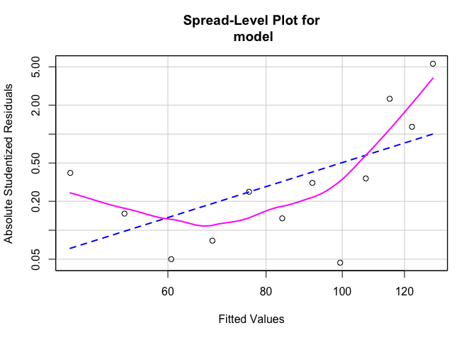
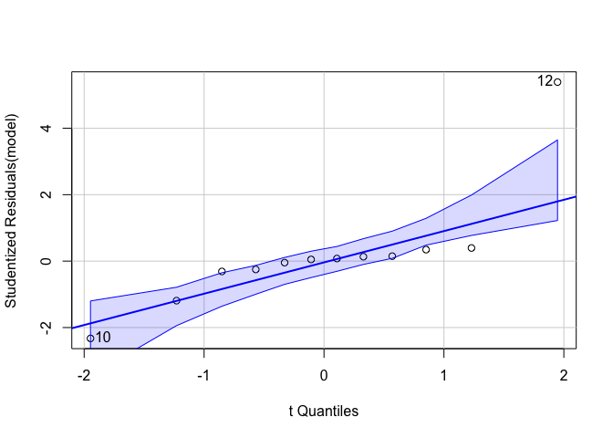
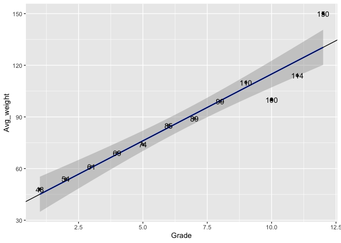

# Linear Regression

สมการถดถอยเส้นตรง หรือ liner regression คือการทดสอบที่ต้องการหาความสัมพันธ์ (relationship) ระหว่างตัวแปร 2 ตัวหรือมากกว่านั้น เราอาจจะคุ้นเคยกับการมีกราฟที่มี แกน x และ y ในบท
Correlation แล้ว


ผลจากบท [correlation](https://amaiesc.github.io/study_r/correlation.html) บอกเราว่า


    Pearson's product-moment correlation

    data:  Grade and Avg_weight
    t = 10.996, df = 10, p-value = 6.614e-07
    alternative hypothesis: true correlation is not equal to 0
    95 percent confidence interval:
    0.8632963 0.9893030
    sample estimates:
          cor 
    0.9610489 


หลังจากที่เราเริ่มรู้ว่า Grade มีความสัมพันธ์สูงกับ Avg\_weight แล้ว (p &lt; 0.001) เราจะเริ่มสร้างโมเดลที่อธิบายความสัมพันธ์นี้กันค่ะ

## เข้าใจ simple regression

โดยปกติแล้วรูปแบบของสมการเส้นตรงจะถูกเขียนไว้ว่า

    y = α + βx + ε
    α หมายถึง y-intercept หรือ จุดที่ข้อมูลตัดบนแกน y
    β หมายถึง ความชันของตัวแปร x
    ε หมายถึงerror ในโมเดล

สมการเส้นตรงเป็นเพียงหนึ่งในโมเดลทางสถิติ (แต่ก็เป็นอันนี้แมวคิดว่าง่ายที่สุด)

ในการวิเคราะห์ simple regression จะมีข้อตกลงเบื้อง (assumption) ข้อตกลงเบื้องต้นนี้ มีไว้เพื่อไม่ให้เกิดอคติทางสถิติในการวิเคราะห์ รวมไปถึง type I, II error ด้วย ดังนั้น เราควรจะทำก่อนสิ่งใด ๆ เสมอบนโมเดลสถิติเราควรตรวจสอบข้อตกลงเบื้องต้นบนข้อมูลของเราเสียก่อนจ้า
 
### ข้อตกลงเบื้องต้นของการใช้สมการถดถอยเส้นตรง (simple linear regression)

1.  Linear relationship : คือ x และ y มีแนวโน้มที่จะเป็นเส้นตรง เราสามารถทดสอบได้โดยการใช้ `cor.test()`
2.  Independence : คือการที่ residuals (ค่าหลงเหลือจากการขีดเส้นตรง) มีความแยกออกจากัน
3.  Homoscedasticity : คือการที่ residuals มีความสม่ำเสมอในทุก ๆ ช่วงของ x
4.  Normality : คือการที่ residuals มีโค้งปกติ Note\* อันนี้คือค่า residuals ไม่ใช่ค่าข้อมูลนะ[1]

เราจะมาทดสอบทีละตัวกันบน data ที่เราสร้างในบท correlation

``` r
Grade <- 1:12
Avg_weight <- c(48, 54, 61, 69, 74, 85, 89, 99, 110, 100, 114, 150)
Avg_coffee <- c(6, 7, 1, 0, 4, 6, 4, 4, 7, 7, 7, 7)
data <- cbind(Grade, Avg_weight, Avg_coffee)
head(data)
```


    ##      Grade Avg_weight Avg_coffee
    ## [1,]     1         48          6
    ## [2,]     2         54          7
    ## [3,]     3         61          1
    ## [4,]     4         69          0
    ## [5,]     5         74          4
    ## [6,]     6         85          6


เนื่องจากการทดสอบข้อตกลงเบื้องต้นใน R มีความเป็นที่แมวจะต้องเขียนโมเดลที่เราต้องการเอาไว้ก่อน เราสามารถเขียนโมเดล simple regression เอาไว้ทดสอบเบื้องต้นเฉย ๆ ได้โดยเรียกคำสั่ง

`model <- lm(ตัวแปร y ~ ตัวแปร x, data = ชื่อไฟล์ข้อมูล)`

ที่สำคัญคือชุดข้อมูลที่เราใส่ลงไปในสมการหรือโมเดลต้องมาจาก **object:
dataframe** ดังนั้นเราจะเปลี่ยนข้อมูลด้วย `as.data.frame()`

``` r
data <- as.data.frame(data)
model <- lm(Avg_weight ~ Grade, data = data)
```

``` r
# 1. ทดสอบ linear regression ใน Grade และ Avg_weight
cor(Avg_weight, Grade)
```

    ## [1] 0.9610489

``` r
# 3. ทดสอบ Homoscedasticity
car::spreadLevelPlot(model)
```



    ## 
    ## Suggested power transformation:  -1.576416

``` r
# 4. ทดสอบ Normality
car::qqPlot(model)
```



    ## [1] 10 12

จะเห็นได้ว่าการทดสอบ 2. independence หายไป ไม่ต้องตกใจ กรณีข้อมูลตัวอย่างไม่เป็นอิสระจากกันอาจจะมาจากการออกแบบการวิจัยของเรา ถ้าเกิดมีการละเมิดข้อในทั้งในทางวิจัยและสถิติ
เราอาจจะต้องไปใช้สถิติทดสอบตัวอื่นค่ะ

ทีนี้ สมมติว่า ข้อมูลของเราสอบผ่านทุกข้อ (เย้) เราก็สามารถเรียกผลของโมเดลออกมาได้แล้ว โดยใช้คำสั่ง `summary()`

``` r
summary(model)
```


    ## 
    ## Call:
    ## lm(formula = Avg_weight ~ Grade, data = data)
    ## 
    ## Residuals:
    ##      Min       1Q   Median       3Q      Max 
    ## -14.9056  -2.2413   0.5262   1.5865  19.5769 
    ## 
    ## Coefficients:
    ##             Estimate Std. Error t value Pr(>|t|)    
    ## (Intercept)  37.3182     5.1930   7.186 2.97e-05 ***
    ## Grade         7.7587     0.7056  10.996 6.61e-07 ***
    ## ---
    ## Signif. codes:  0 '***' 0.001 '**' 0.01 '*' 0.05 '.' 0.1 ' ' 1
    ## 
    ## Residual standard error: 8.438 on 10 degrees of freedom
    ## Multiple R-squared:  0.9236, Adjusted R-squared:  0.916 
    ## F-statistic: 120.9 on 1 and 10 DF,  p-value: 6.614e-07

ผล output จาก R บอกเราว่า เมื่อเกรดเพิ่มขึ้น 1 หน่วย จะทำให้น้ำหนักเพิ่มขึ้น 7.7587 อย่างมีนัยสำคัญทางสถิติ และตัวแปรต้นสามารถอธิบายตัวแปรตามได้อยู่ที่ 92 เปอร์เซ็นต์อย่างมีนัยสำคัญทางสถิติ

งงใข่ไหม

งงแหละ55

เดี๋ยวมา plot graph กันสักหน่อยดีกว่า

``` r
library(ggplot2)
ggplot(data, aes(x = Grade, y = Avg_weight, label = Avg_weight)) +
  geom_point(stat = "identity") +
  geom_smooth(method = lm) +
  geom_text() +
  geom_abline(intercept = 37.3182, slope = 7.7587)
```




    Coefficients:
                Estimate Std. Error t value Pr(>|t|)    
    (Intercept)  37.3182     5.1930   7.186 2.97e-05 ***
    Grade         7.7587     0.7056  10.996 6.61e-07 ***
    ---
    Signif. codes:  0 ‘***’ 0.001 ‘**’ 0.01 ‘*’ 0.05 ‘.’ 0.1 ‘ ’ 1

จากผลการวิเคราะห์ด้านบนพบว่า จุดตัดที่แกน y (หรือการที่ Grade = 0) คือ 37.3182 และเมื่อ Grade เพิ่มขึ้น 1 หน่วย จะทำให้ค่าของน้ำหนักเพิ่มขึ้น 7.7587 หรือก็คือ 37.3182 + 7.7587 นั่นเอง

ดังนั้น สมการโมเดลนี้ สามารถเขียนได้ดังนั้น

    Avg_weight = 37.3182 + 7.7587(Grade) + e

ส่วนผลชุดนี้

    Residual standard error: 8.438 on 10 degrees of freedom
    Multiple R-squared:  0.9236,    Adjusted R-squared:  0.916 
    F-statistic: 120.9 on 1 and 10 DF,  p-value: 6.614e-07

  
คือการอธิบายว่า ตัวแปร `Grade` สามารถอธิบายโมเดลได้เท่ากับเท่าไหร่ ค่านี้เรียกว่า `R-squared` ซึ่งเท่ากับ 0.9236 หรือก็คือ 92.36% โดยทดสอบด้วย `F-test` พบว่ามีนัยสำคัญทางสถิติที่ *p* &lt; 0.001


_____________________________________
[1] อ่านเพิ่มเติมได้ที่
<https://www.researchgate.net/publication/322794573_The_Myth_of_the_Normal_Curve_a_Theoretical_Critique_and_Examination_of_its_Role_in_Teaching_and_Research>
